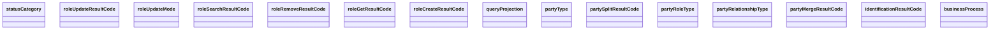

# Enumerations

```mermaid
classDiagram
    class statusCategory["statusCategory"]
    class roleUpdateResultCode["roleUpdateResultCode"]
    class roleUpdateMode["roleUpdateMode"]
    class roleSearchResultCode["roleSearchResultCode"]
    class roleRemoveResultCode["roleRemoveResultCode"]
    class roleGetResultCode["roleGetResultCode"]
    class roleCreateResultCode["roleCreateResultCode"]
    class queryProjection["queryProjection"]
    class partyType["partyType"]
    class partySplitResultCode["partySplitResultCode"]
    class partyRoleType["partyRoleType"]
    class partyRelationshipType["partyRelationshipType"]
    class partyMergeResultCode["partyMergeResultCode"]
    class identificationResultCode["identificationResultCode"]
    class businessProcess["businessProcess"]
```
