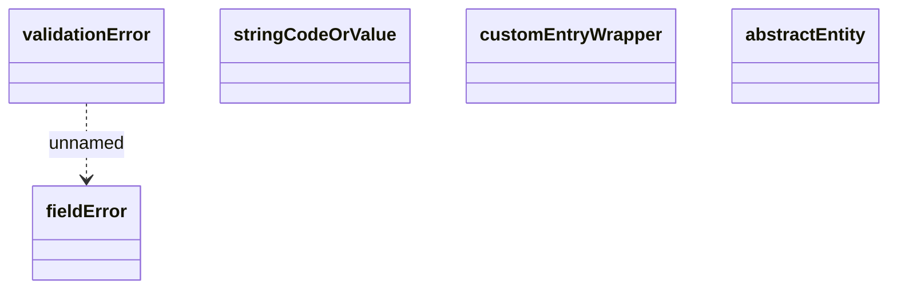

# Framework-core

- **Diagram Type**: Logical
- **Package**: HomerSelect/BSL/Analysis Model/_Interface/Consumed services/PartyWS/Common/Types
- **Diagram ID**: 157639
- **Elements**: 5
- **Connectors**: 1

