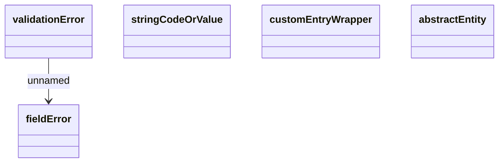

# Framework-core

```mermaid
classDiagram
    class fieldError["fieldError"]
    class validationError["validationError"]
    class stringCodeOrValue["stringCodeOrValue"]
    class customEntryWrapper["customEntryWrapper"]
    class abstractEntity["abstractEntity"]
    validationError --> fieldError : unnamed
```
