# PartyWS-organization

- **Diagram Type**: Logical
- **Package**: HomerSelect/BSL/Analysis Model/_Interface/Consumed services/PartyWS/Organization
- **Diagram ID**: 76411
- **Elements**: 13
- **Connectors**: 12

```mermaid
classDiagram
    class customerOrganizationUpdateResponse["customerOrganizationUpdateResponse"]
    class customerOrganizationSearchResponse["customerOrganizationSearchResponse"]
    class customerOrganizationRemoveResponse["customerOrganizationRemoveResponse"]
    class customerOrganizationIdentifyResponse["customerOrganizationIdentifyResponse"]
    class customerOrganizationGetResponse["customerOrganizationGetResponse"]
    class customerOrganizationCreateResponse["customerOrganizationCreateResponse"]
    class customerOrganizationUpdateRequest["customerOrganizationUpdateRequest"]
    class customerOrganizationSearchRequest["customerOrganizationSearchRequest"]
    class customerOrganizationRemoveRequest["customerOrganizationRemoveRequest"]
    class customerOrganizationIdentifyRequest["customerOrganizationIdentifyRequest"]
    class customerOrganizationGetRequest["customerOrganizationGetRequest"]
    class customerOrganizationCreateRequest["customerOrganizationCreateRequest"]
    class PartyWS["PartyWS"]
    PartyWS ..> customerOrganizationUpdateResponse : unnamed
    PartyWS ..> customerOrganizationSearchResponse : unnamed
    PartyWS ..> customerOrganizationRemoveResponse : unnamed
    PartyWS ..> customerOrganizationIdentifyResponse : unnamed
    PartyWS ..> customerOrganizationGetResponse : unnamed
    PartyWS ..> customerOrganizationCreateResponse : unnamed
    PartyWS ..> customerOrganizationUpdateRequest : unnamed
    PartyWS ..> customerOrganizationSearchRequest : unnamed
    PartyWS ..> customerOrganizationRemoveRequest : unnamed
    PartyWS ..> customerOrganizationIdentifyRequest : unnamed
    PartyWS ..> customerOrganizationGetRequest : unnamed
    PartyWS ..> customerOrganizationCreateRequest : unnamed
```

