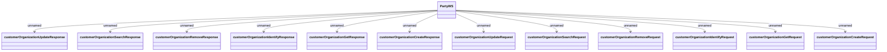

# PartyWS-organization

```mermaid
classDiagram
    class customerOrganizationUpdateResponse["customerOrganizationUpdateResponse"]
    class customerOrganizationSearchResponse["customerOrganizationSearchResponse"]
    class customerOrganizationRemoveResponse["customerOrganizationRemoveResponse"]
    class customerOrganizationIdentifyResponse["customerOrganizationIdentifyResponse"]
    class customerOrganizationGetResponse["customerOrganizationGetResponse"]
    class customerOrganizationCreateResponse["customerOrganizationCreateResponse"]
    class customerOrganizationUpdateRequest["customerOrganizationUpdateRequest"]
    class customerOrganizationSearchRequest["customerOrganizationSearchRequest"]
    class customerOrganizationRemoveRequest["customerOrganizationRemoveRequest"]
    class customerOrganizationIdentifyRequest["customerOrganizationIdentifyRequest"]
    class customerOrganizationGetRequest["customerOrganizationGetRequest"]
    class customerOrganizationCreateRequest["customerOrganizationCreateRequest"]
    class PartyWS["PartyWS"]
    PartyWS --> customerOrganizationUpdateResponse : unnamed
    PartyWS --> customerOrganizationSearchResponse : unnamed
    PartyWS --> customerOrganizationRemoveResponse : unnamed
    PartyWS --> customerOrganizationIdentifyResponse : unnamed
    PartyWS --> customerOrganizationGetResponse : unnamed
    PartyWS --> customerOrganizationCreateResponse : unnamed
    PartyWS --> customerOrganizationUpdateRequest : unnamed
    PartyWS --> customerOrganizationSearchRequest : unnamed
    PartyWS --> customerOrganizationRemoveRequest : unnamed
    PartyWS --> customerOrganizationIdentifyRequest : unnamed
    PartyWS --> customerOrganizationGetRequest : unnamed
    PartyWS --> customerOrganizationCreateRequest : unnamed
```
