# PartyWS-Person

- **Diagram Type**: Logical
- **Package**: HomerSelect/BSL/Analysis Model/_Interface/Consumed services/PartyWS/Person
- **Diagram ID**: 137757
- **Elements**: 20
- **Connectors**: 20

```mermaid
classDiagram
    class customerPersonCreateOrUpdateResponse["customerPersonCreateOrUpdateResponse"]
    class customerPersonCreateOrUpdateRequest["customerPersonCreateOrUpdateRequest"]
    class createOptions["createOptions"]
    class customerPersonUpdateResponse["customerPersonUpdateResponse"]
    class customerPersonSplitResponse["customerPersonSplitResponse"]
    class customerPersonSearchResponse["customerPersonSearchResponse"]
    class customerPersonRemoveResponse["customerPersonRemoveResponse"]
    class customerPersonMergeResponse["customerPersonMergeResponse"]
    class customerPersonIdentifyResponse["customerPersonIdentifyResponse"]
    class customerPersonGetResponse["customerPersonGetResponse"]
    class customerPersonCreateResponse["customerPersonCreateResponse"]
    class customerPersonUpdateRequest["customerPersonUpdateRequest"]
    class customerPersonSplitRequest["customerPersonSplitRequest"]
    class customerPersonSearchRequest["customerPersonSearchRequest"]
    class customerPersonRemoveRequest["customerPersonRemoveRequest"]
    class customerPersonMergeRequest["customerPersonMergeRequest"]
    class customerPersonIdentifyRequest["customerPersonIdentifyRequest"]
    class customerPersonGetRequest["customerPersonGetRequest"]
    class customerPersonCreateRequest["customerPersonCreateRequest"]
    class PartyWS["PartyWS"]
    PartyWS ..> customerPersonGetResponse : unnamed
    PartyWS ..> customerPersonCreateOrUpdateRequest : unnamed
    PartyWS ..> customerPersonUpdateResponse : unnamed
    PartyWS ..> customerPersonSplitResponse : unnamed
    PartyWS ..> customerPersonSearchResponse : unnamed
    PartyWS ..> customerPersonRemoveResponse : unnamed
    PartyWS ..> customerPersonCreateOrUpdateResponse : unnamed
    PartyWS ..> customerPersonIdentifyResponse : unnamed
    PartyWS ..> customerPersonCreateRequest : unnamed
    PartyWS ..> customerPersonCreateResponse : unnamed
    PartyWS ..> customerPersonUpdateRequest : unnamed
    PartyWS ..> customerPersonSplitRequest : unnamed
    PartyWS ..> customerPersonSearchRequest : unnamed
    PartyWS ..> customerPersonRemoveRequest : unnamed
    PartyWS ..> customerPersonMergeRequest : unnamed
    PartyWS ..> customerPersonIdentifyRequest : unnamed
    PartyWS ..> customerPersonGetRequest : unnamed
    PartyWS ..> customerPersonMergeResponse : unnamed
    customerPersonCreateRequest ..> createOptions : unnamed
    customerPersonCreateOrUpdateRequest ..> createOptions : unnamed
```

