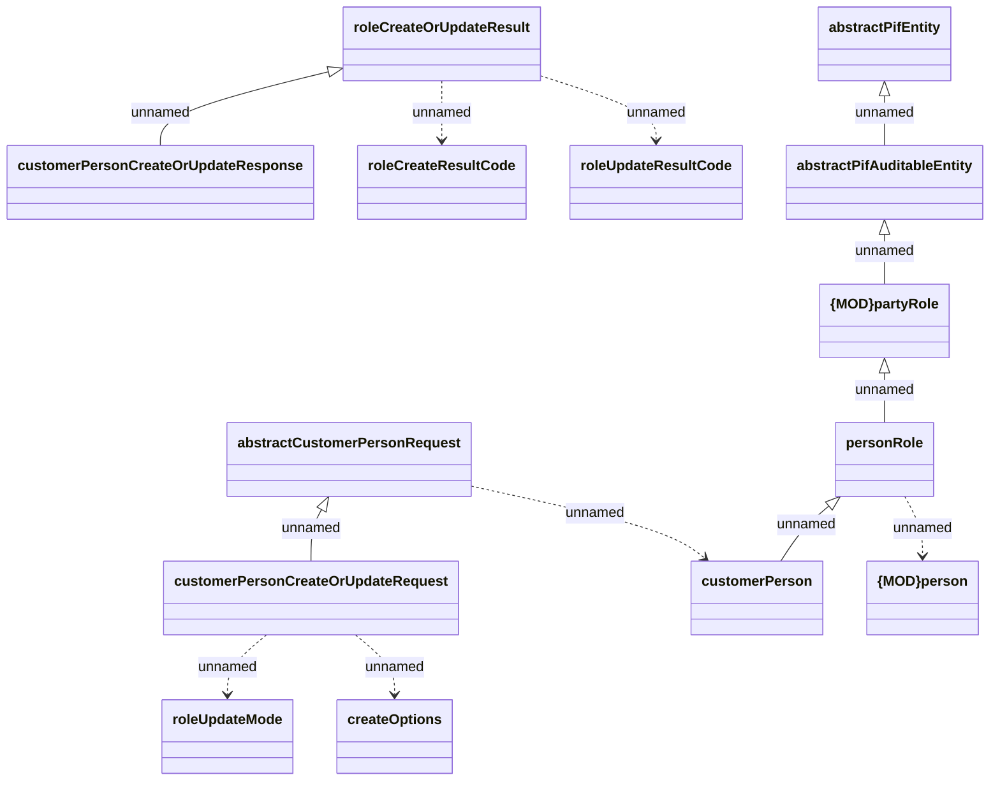

# customerPersonCreateOrUpdate

- **Diagram Type**: Logical
- **Package**: HomerSelect/BSL/Analysis Model/_Interface/Consumed services/PartyWS/Person
- **Diagram ID**: 137764
- **Elements**: 14
- **Connectors**: 12

