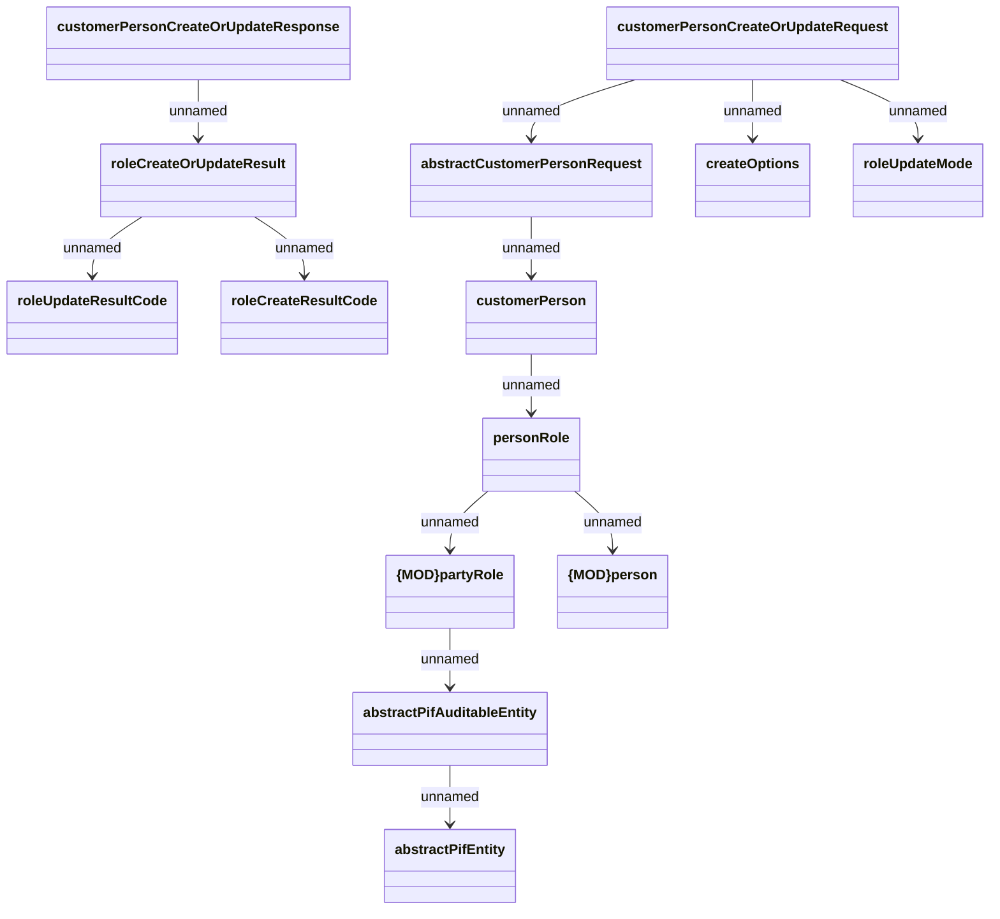

# customerPersonCreateOrUpdate

```mermaid
classDiagram
    class roleUpdateResultCode["roleUpdateResultCode"]
    class roleCreateResultCode["roleCreateResultCode"]
    class roleCreateOrUpdateResult["roleCreateOrUpdateResult"]
    class abstractPifEntity["abstractPifEntity"]
    class abstractPifAuditableEntity["abstractPifAuditableEntity"]
    class MOD_partyRole["{MOD}partyRole"]
    class abstractCustomerPersonRequest["abstractCustomerPersonRequest"]
    class MOD_person["{MOD}person"]
    class personRole["personRole"]
    class customerPerson["customerPerson"]
    class customerPersonCreateOrUpdateResponse["customerPersonCreateOrUpdateResponse"]
    class customerPersonCreateOrUpdateRequest["customerPersonCreateOrUpdateRequest"]
    class createOptions["createOptions"]
    class roleUpdateMode["roleUpdateMode"]
    customerPersonCreateOrUpdateRequest --> abstractCustomerPersonRequest : unnamed
    customerPersonCreateOrUpdateRequest --> roleUpdateMode : unnamed
    customerPersonCreateOrUpdateRequest --> createOptions : unnamed
    customerPersonCreateOrUpdateResponse --> roleCreateOrUpdateResult : unnamed
    abstractCustomerPersonRequest --> customerPerson : unnamed
    customerPerson --> personRole : unnamed
    abstractPifAuditableEntity --> abstractPifEntity : unnamed
    personRole --> MOD_person : unnamed
    MOD_partyRole --> abstractPifAuditableEntity : unnamed
    personRole --> MOD_partyRole : unnamed
    roleCreateOrUpdateResult --> roleCreateResultCode : unnamed
    roleCreateOrUpdateResult --> roleUpdateResultCode : unnamed
```
