# customerPersonGetResponse

- **Diagram Type**: Logical
- **Package**: HomerSelect/BSL/Analysis Model/_Interface/Consumed services/PartyWS/Person
- **Diagram ID**: 137758
- **Elements**: 29
- **Connectors**: 45

```mermaid
classDiagram
    class status["status"]
    class statusCategory["statusCategory"]
    class Person_CustomValues["Person : CustomValues"]
    class party["party"]
    class partyType["partyType"]
    class MOD_person["{MOD}person"]
    class relatedPersonInfo["relatedPersonInfo"]
    class employmentInfo["employmentInfo"]
    class safeGuaranty["safeGuaranty"]
    class socialNetwork["socialNetwork"]
    class roleStatus["roleStatus"]
    class contactStatus["contactStatus"]
    class partyRelationshipType["partyRelationshipType"]
    class customerPersonRelationship["customerPersonRelationship"]
    class partyRelationship["partyRelationship"]
    class postalAddress["postalAddress"]
    class phoneNumber["phoneNumber"]
    class abstractContact["abstractContact"]
    class emailAddress["emailAddress"]
    class consent["consent"]
    class partyRoleType["partyRoleType"]
    class personRole["personRole"]
    class representativePerson["representativePerson"]
    class customerPerson["customerPerson"]
    class customEntryWrapper["customEntryWrapper"]
    class document["document"]
    class roleGetResultCode["roleGetResultCode"]
    class MOD_partyRole["{MOD}partyRole"]
    class customerPersonGetResponse["customerPersonGetResponse"]
    customerPersonGetResponse ..> roleGetResultCode : unnamed
    customerPersonGetResponse ..> MOD_partyRole : unnamed
    customerPersonRelationship ..> relatedPersonInfo : unnamed
    safeGuaranty ..> customerPersonRelationship : unnamed
    partyRelationship <|-- customerPersonRelationship : unnamed
    customerPersonRelationship ..> safeGuaranty : unnamed
    customerPersonRelationship ..> employmentInfo : unnamed
    MOD_partyRole ..> customEntryWrapper : unnamed
    document ..> customEntryWrapper : unnamed
    consent ..> customEntryWrapper : unnamed
    personRole <|-- representativePerson : unnamed
    status <|-- roleStatus : unnamed
    status ..> statusCategory : unnamed
    status <|-- contactStatus : unnamed
    partyRelationship ..> partyRelationshipType : unnamed
    MOD_partyRole ..> partyRelationship : unnamed
    MOD_partyRole ..> partyRelationship : unnamed
    personRole <|-- customerPerson : unnamed
    MOD_partyRole ..> emailAddress : unnamed
    abstractContact <|-- emailAddress : unnamed
    relatedPersonInfo ..> emailAddress : unnamed
    employmentInfo ..> emailAddress : unnamed
    party <|-- MOD_person : unnamed
    party ..> document : unnamed
    party ..> postalAddress : unnamed
    party ..> partyType : unnamed
    MOD_partyRole ..> postalAddress : unnamed
    employmentInfo ..> postalAddress : unnamed
    relatedPersonInfo ..> postalAddress : unnamed
    postalAddress ..> contactStatus : unnamed
    personRole ..> MOD_person : unnamed
    employmentInfo ..> phoneNumber : unnamed
    abstractContact <|-- phoneNumber : unnamed
    relatedPersonInfo ..> phoneNumber : unnamed
    MOD_partyRole ..> phoneNumber : unnamed
    abstractContact <|-- socialNetwork : unnamed
    abstractContact ..> contactStatus : unnamed
    MOD_partyRole ..> roleStatus : unnamed
    employmentInfo ..> socialNetwork : unnamed
    MOD_partyRole ..> socialNetwork : unnamed
    relatedPersonInfo ..> socialNetwork : unnamed
    MOD_partyRole ..> document : unnamed
    MOD_partyRole <|-- personRole : unnamed
    MOD_partyRole ..> consent : unnamed
    MOD_partyRole ..> partyRoleType : unnamed
```

