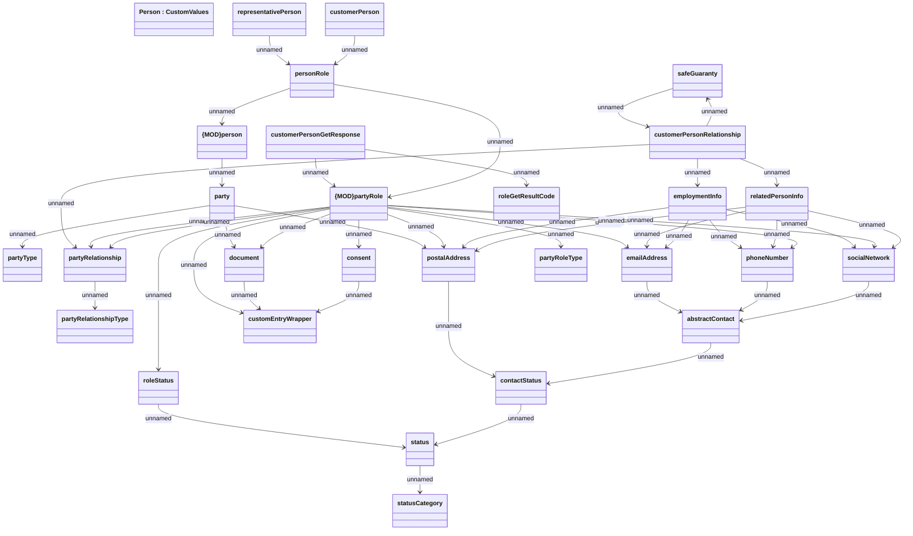

# customerPersonGetResponse

```mermaid
classDiagram
    class status["status"]
    class statusCategory["statusCategory"]
    class Person_CustomValues["Person : CustomValues"]
    class party["party"]
    class partyType["partyType"]
    class MOD_person["{MOD}person"]
    class relatedPersonInfo["relatedPersonInfo"]
    class employmentInfo["employmentInfo"]
    class safeGuaranty["safeGuaranty"]
    class socialNetwork["socialNetwork"]
    class roleStatus["roleStatus"]
    class contactStatus["contactStatus"]
    class partyRelationshipType["partyRelationshipType"]
    class customerPersonRelationship["customerPersonRelationship"]
    class partyRelationship["partyRelationship"]
    class postalAddress["postalAddress"]
    class phoneNumber["phoneNumber"]
    class abstractContact["abstractContact"]
    class emailAddress["emailAddress"]
    class consent["consent"]
    class partyRoleType["partyRoleType"]
    class personRole["personRole"]
    class representativePerson["representativePerson"]
    class customerPerson["customerPerson"]
    class customEntryWrapper["customEntryWrapper"]
    class document["document"]
    class roleGetResultCode["roleGetResultCode"]
    class MOD_partyRole["{MOD}partyRole"]
    class customerPersonGetResponse["customerPersonGetResponse"]
    customerPersonGetResponse --> roleGetResultCode : unnamed
    customerPersonGetResponse --> MOD_partyRole : unnamed
    customerPersonRelationship --> relatedPersonInfo : unnamed
    safeGuaranty --> customerPersonRelationship : unnamed
    customerPersonRelationship --> partyRelationship : unnamed
    customerPersonRelationship --> safeGuaranty : unnamed
    customerPersonRelationship --> employmentInfo : unnamed
    MOD_partyRole --> customEntryWrapper : unnamed
    document --> customEntryWrapper : unnamed
    consent --> customEntryWrapper : unnamed
    representativePerson --> personRole : unnamed
    roleStatus --> status : unnamed
    status --> statusCategory : unnamed
    contactStatus --> status : unnamed
    partyRelationship --> partyRelationshipType : unnamed
    MOD_partyRole --> partyRelationship : unnamed
    MOD_partyRole --> partyRelationship : unnamed
    customerPerson --> personRole : unnamed
    MOD_partyRole --> emailAddress : unnamed
    emailAddress --> abstractContact : unnamed
    relatedPersonInfo --> emailAddress : unnamed
    employmentInfo --> emailAddress : unnamed
    MOD_person --> party : unnamed
    party --> document : unnamed
    party --> postalAddress : unnamed
    party --> partyType : unnamed
    MOD_partyRole --> postalAddress : unnamed
    employmentInfo --> postalAddress : unnamed
    relatedPersonInfo --> postalAddress : unnamed
    postalAddress --> contactStatus : unnamed
    personRole --> MOD_person : unnamed
    employmentInfo --> phoneNumber : unnamed
    phoneNumber --> abstractContact : unnamed
    relatedPersonInfo --> phoneNumber : unnamed
    MOD_partyRole --> phoneNumber : unnamed
    socialNetwork --> abstractContact : unnamed
    abstractContact --> contactStatus : unnamed
    MOD_partyRole --> roleStatus : unnamed
    employmentInfo --> socialNetwork : unnamed
    MOD_partyRole --> socialNetwork : unnamed
    relatedPersonInfo --> socialNetwork : unnamed
    MOD_partyRole --> document : unnamed
    personRole --> MOD_partyRole : unnamed
    MOD_partyRole --> consent : unnamed
    MOD_partyRole --> partyRoleType : unnamed
```
