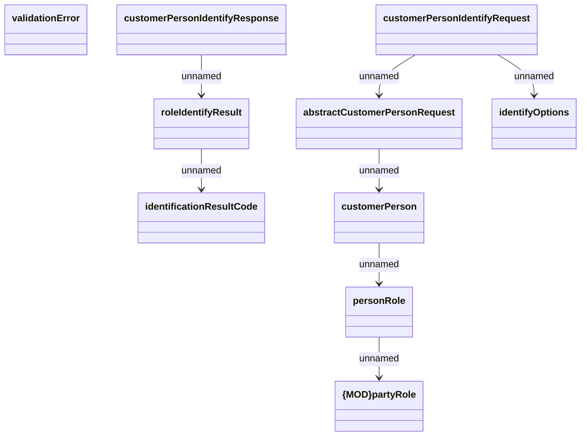

# customerPersonIdentify

```mermaid
classDiagram
    class MOD_partyRole["{MOD}partyRole"]
    class validationError["validationError"]
    class identificationResultCode["identificationResultCode"]
    class roleIdentifyResult["roleIdentifyResult"]
    class customerPersonIdentifyResponse["customerPersonIdentifyResponse"]
    class abstractCustomerPersonRequest["abstractCustomerPersonRequest"]
    class personRole["personRole"]
    class customerPerson["customerPerson"]
    class identifyOptions["identifyOptions"]
    class customerPersonIdentifyRequest["customerPersonIdentifyRequest"]
    customerPersonIdentifyResponse --> roleIdentifyResult : unnamed
    customerPersonIdentifyRequest --> abstractCustomerPersonRequest : unnamed
    customerPersonIdentifyRequest --> identifyOptions : unnamed
    abstractCustomerPersonRequest --> customerPerson : unnamed
    customerPerson --> personRole : unnamed
    roleIdentifyResult --> identificationResultCode : unnamed
    personRole --> MOD_partyRole : unnamed
```
