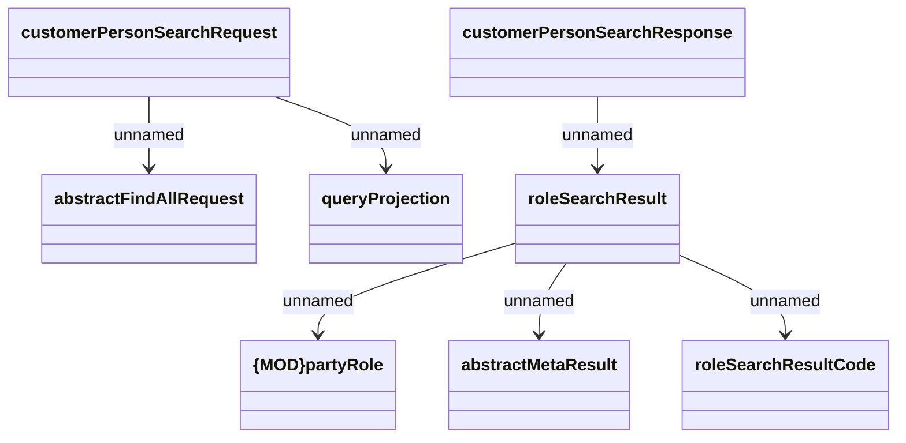

# customerPersonSearch

```mermaid
classDiagram
    class roleSearchResultCode["roleSearchResultCode"]
    class MOD_partyRole["{MOD}partyRole"]
    class abstractFindAllRequest["abstractFindAllRequest"]
    class queryProjection["queryProjection"]
    class roleSearchResult["roleSearchResult"]
    class abstractMetaResult["abstractMetaResult"]
    class customerPersonSearchResponse["customerPersonSearchResponse"]
    class customerPersonSearchRequest["customerPersonSearchRequest"]
    customerPersonSearchRequest --> abstractFindAllRequest : unnamed
    customerPersonSearchRequest --> queryProjection : unnamed
    customerPersonSearchResponse --> roleSearchResult : unnamed
    roleSearchResult --> MOD_partyRole : unnamed
    roleSearchResult --> abstractMetaResult : unnamed
    roleSearchResult --> roleSearchResultCode : unnamed
```
