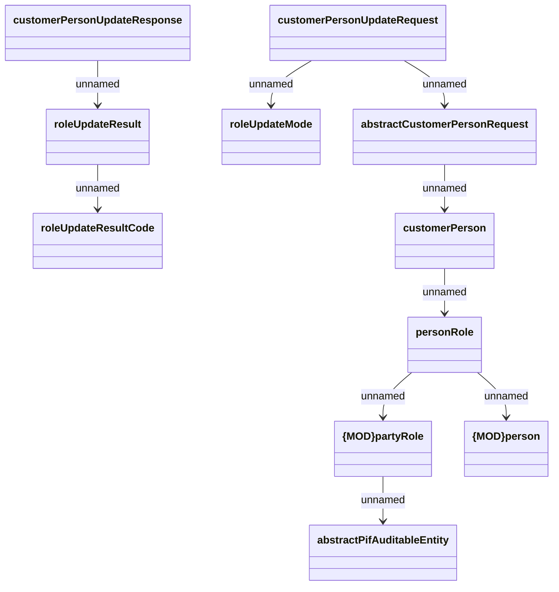

# customerPersonUpdate

```mermaid
classDiagram
    class abstractPifAuditableEntity["abstractPifAuditableEntity"]
    class roleUpdateResultCode["roleUpdateResultCode"]
    class MOD_partyRole["{MOD}partyRole"]
    class abstractCustomerPersonRequest["abstractCustomerPersonRequest"]
    class MOD_person["{MOD}person"]
    class personRole["personRole"]
    class customerPerson["customerPerson"]
    class roleUpdateMode["roleUpdateMode"]
    class roleUpdateResult["roleUpdateResult"]
    class customerPersonUpdateResponse["customerPersonUpdateResponse"]
    class customerPersonUpdateRequest["customerPersonUpdateRequest"]
    customerPersonUpdateRequest --> abstractCustomerPersonRequest : unnamed
    customerPersonUpdateRequest --> roleUpdateMode : unnamed
    abstractCustomerPersonRequest --> customerPerson : unnamed
    customerPersonUpdateResponse --> roleUpdateResult : unnamed
    customerPerson --> personRole : unnamed
    roleUpdateResult --> roleUpdateResultCode : unnamed
    personRole --> MOD_person : unnamed
    MOD_partyRole --> abstractPifAuditableEntity : unnamed
    personRole --> MOD_partyRole : unnamed
```
