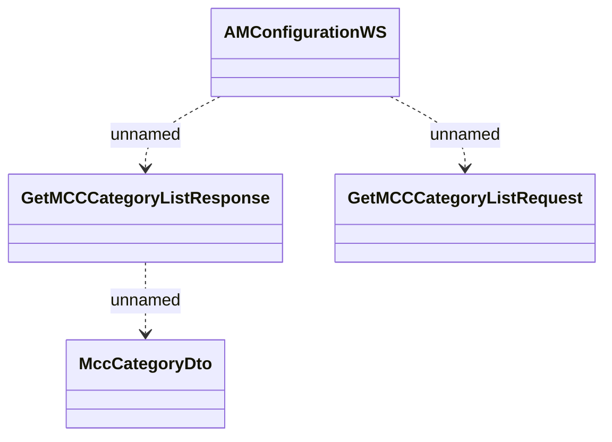

# AMConfigurationWS

- **Diagram Type**: Logical
- **Package**: HomerSelect/BSL/Analysis Model/_Interface/Consumed services/Payment Card system/Account/AMConfigurationWS
- **Diagram ID**: 79157
- **Elements**: 4
- **Connectors**: 3

