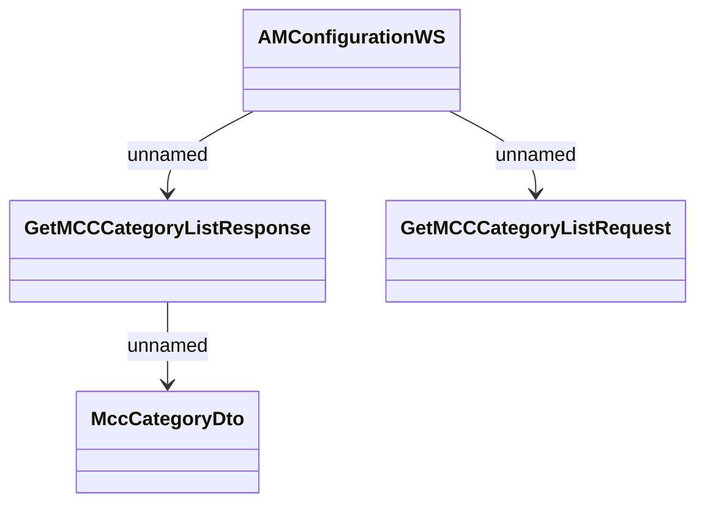

# AMConfigurationWS

```mermaid
classDiagram
    class MccCategoryDto["MccCategoryDto"]
    class GetMCCCategoryListResponse["GetMCCCategoryListResponse"]
    class GetMCCCategoryListRequest["GetMCCCategoryListRequest"]
    class AMConfigurationWS["AMConfigurationWS"]
    GetMCCCategoryListResponse --> MccCategoryDto : unnamed
    AMConfigurationWS --> GetMCCCategoryListResponse : unnamed
    AMConfigurationWS --> GetMCCCategoryListRequest : unnamed
```
