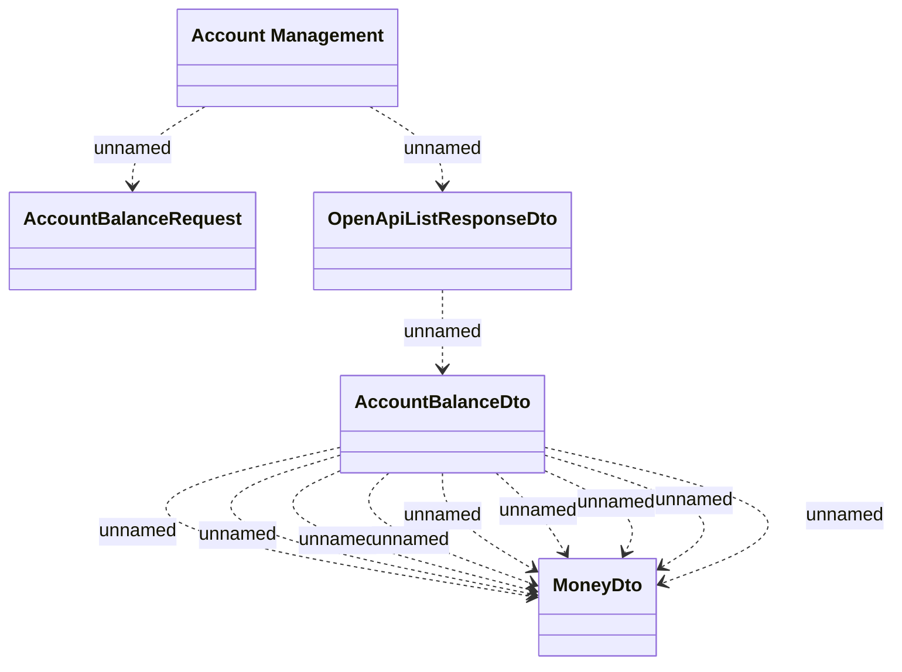

# Account Management - REST

- **Diagram Type**: Logical
- **Package**: HomerSelect/BSL/Analysis Model/_Interface/Consumed services/Payment Card system/Account/Account Management/Account Management - REST_v2
- **Diagram ID**: 124534
- **Elements**: 5
- **Connectors**: 12

