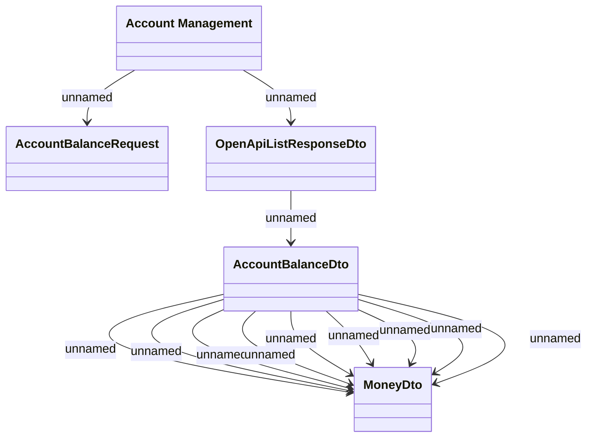

# Account Management - REST

```mermaid
classDiagram
    class AccountBalanceRequest["AccountBalanceRequest"]
    class Account_Management["Account Management"]
    class MoneyDto["MoneyDto"]
    class AccountBalanceDto["AccountBalanceDto"]
    class OpenApiListResponseDto["OpenApiListResponseDto"]
    Account_Management --> OpenApiListResponseDto : unnamed
    OpenApiListResponseDto --> AccountBalanceDto : unnamed
    AccountBalanceDto --> MoneyDto : unnamed
    AccountBalanceDto --> MoneyDto : unnamed
    AccountBalanceDto --> MoneyDto : unnamed
    AccountBalanceDto --> MoneyDto : unnamed
    AccountBalanceDto --> MoneyDto : unnamed
    AccountBalanceDto --> MoneyDto : unnamed
    AccountBalanceDto --> MoneyDto : unnamed
    AccountBalanceDto --> MoneyDto : unnamed
    AccountBalanceDto --> MoneyDto : unnamed
    Account_Management --> AccountBalanceRequest : unnamed
```
