# Account Management - Messages - Interface diagram

- **Diagram Type**: Logical
- **Package**: HomerSelect/BSL/Analysis Model/_Interface/Consumed services/Payment Card system/Account/Account Management/AccountManagementWS (v2)/Account Management - Messages
- **Diagram ID**: 133245
- **Elements**: 39
- **Connectors**: 24

```mermaid
classDiagram
    class GetAccountBillingPeriodBalancesRequest["GetAccountBillingPeriodBalancesRequest"]
    class GetAccountBillingPeriodBalancesResponse["GetAccountBillingPeriodBalancesResponse"]
    class AccountManagementSearchResponseBaseDto["AccountManagementSearchResponseBaseDto"]
    class GetAccountHistoryResponse["GetAccountHistoryResponse"]
    class AccountItemSearchDto["AccountItemSearchDto"]
    class AccountManagementSearchBaseDto["AccountManagementSearchBaseDto"]
    class GetAccountItemsResponse["GetAccountItemsResponse"]
    class GetAccountItemsRequest["GetAccountItemsRequest"]
    class ContractUpdateNotificationResponse["ContractUpdateNotificationResponse"]
    class ContractUpdateNotificationRequest["ContractUpdateNotificationRequest"]
    class GenerateStatementResponse["GenerateStatementResponse"]
    class GenerateStatementRequest["GenerateStatementRequest"]
    class TerminateSimulationResponse["TerminateSimulationResponse"]
    class RepaymentSimulationResponse["RepaymentSimulationResponse"]
    class RepaymentSimulationResponseBase["RepaymentSimulationResponseBase"]
    class TerminateSimulationRequest["TerminateSimulationRequest"]
    class RepaymentSimulationRequest["RepaymentSimulationRequest"]
    class RepaymentSimulationRequestBase["RepaymentSimulationRequestBase"]
    class CancelAccountResponse["CancelAccountResponse"]
    class CancelAccountRequest["CancelAccountRequest"]
    class ActivateAccountResponse["ActivateAccountResponse"]
    class ActivateAccountRequest["ActivateAccountRequest"]
    class GetAccountBalanceByCuidResponse["GetAccountBalanceByCuidResponse"]
    class GetAccountBalanceByCuidRequest["GetAccountBalanceByCuidRequest"]
    class GetAccountBalanceResponse["GetAccountBalanceResponse"]
    class GetAccountBalanceRequest["GetAccountBalanceRequest"]
    class GetBlockingReasonsResponse["GetBlockingReasonsResponse"]
    class GetBlockingReasonsRequest["GetBlockingReasonsRequest"]
    class UnblockAccountResponse["UnblockAccountResponse"]
    class UnblockAccountRequest["UnblockAccountRequest"]
    class BlockAccountResponse["BlockAccountResponse"]
    class BlockAccountRequest["BlockAccountRequest"]
    class GetAccountListResponse["GetAccountListResponse"]
    class GetAccountListRequest["GetAccountListRequest"]
    class GetAccountResponse["GetAccountResponse"]
    class GetAccountRequest["GetAccountRequest"]
    class CreateAccountResponse["CreateAccountResponse"]
    class CreateAccountRequest["CreateAccountRequest"]
    class AccountManagementResponseBaseDto["AccountManagementResponseBaseDto"]
    AccountManagementResponseBaseDto <|-- CreateAccountResponse : unnamed
    AccountManagementSearchResponseBaseDto <|-- GetAccountItemsResponse : unnamed
    AccountManagementSearchResponseBaseDto <|-- GetAccountListResponse : unnamed
    GetAccountItemsRequest ..> AccountItemSearchDto : unnamed
    AccountManagementSearchBaseDto <|-- GetAccountBillingPeriodBalancesRequest : unnamed
    AccountManagementSearchBaseDto <|-- GetAccountItemsRequest : unnamed
    AccountManagementSearchBaseDto <|-- GetAccountListRequest : unnamed
    RepaymentSimulationResponseBase <|-- TerminateSimulationResponse : unnamed
    RepaymentSimulationResponseBase <|-- RepaymentSimulationResponse : unnamed
    RepaymentSimulationRequestBase <|-- RepaymentSimulationRequest : unnamed
    AccountManagementSearchResponseBaseDto <|-- GetAccountBillingPeriodBalancesResponse : unnamed
    AccountManagementResponseBaseDto <|-- CancelAccountResponse : unnamed
    AccountManagementResponseBaseDto <|-- GetAccountBalanceByCuidResponse : unnamed
    AccountManagementResponseBaseDto <|-- ActivateAccountResponse : unnamed
    AccountManagementResponseBaseDto <|-- GetAccountResponse : unnamed
    AccountManagementResponseBaseDto <|-- UnblockAccountResponse : unnamed
    AccountManagementResponseBaseDto <|-- ContractUpdateNotificationResponse : unnamed
    AccountManagementResponseBaseDto <|-- GetAccountHistoryResponse : unnamed
    AccountManagementResponseBaseDto <|-- AccountManagementSearchResponseBaseDto : unnamed
    AccountManagementResponseBaseDto <|-- GetAccountBalanceResponse : unnamed
    AccountManagementResponseBaseDto <|-- GetBlockingReasonsResponse : unnamed
    AccountManagementResponseBaseDto <|-- BlockAccountResponse : unnamed
    RepaymentSimulationRequestBase <|-- TerminateSimulationRequest : unnamed
    AccountManagementResponseBaseDto <|-- RepaymentSimulationResponseBase : unnamed
```

