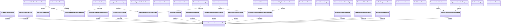

# Account Management - Messages - Interface diagram

```mermaid
classDiagram
    class GetAccountBillingPeriodBalancesRequest["GetAccountBillingPeriodBalancesRequest"]
    class GetAccountBillingPeriodBalancesResponse["GetAccountBillingPeriodBalancesResponse"]
    class AccountManagementSearchResponseBaseDto["AccountManagementSearchResponseBaseDto"]
    class GetAccountHistoryResponse["GetAccountHistoryResponse"]
    class AccountItemSearchDto["AccountItemSearchDto"]
    class AccountManagementSearchBaseDto["AccountManagementSearchBaseDto"]
    class GetAccountItemsResponse["GetAccountItemsResponse"]
    class GetAccountItemsRequest["GetAccountItemsRequest"]
    class ContractUpdateNotificationResponse["ContractUpdateNotificationResponse"]
    class ContractUpdateNotificationRequest["ContractUpdateNotificationRequest"]
    class GenerateStatementResponse["GenerateStatementResponse"]
    class GenerateStatementRequest["GenerateStatementRequest"]
    class TerminateSimulationResponse["TerminateSimulationResponse"]
    class RepaymentSimulationResponse["RepaymentSimulationResponse"]
    class RepaymentSimulationResponseBase["RepaymentSimulationResponseBase"]
    class TerminateSimulationRequest["TerminateSimulationRequest"]
    class RepaymentSimulationRequest["RepaymentSimulationRequest"]
    class RepaymentSimulationRequestBase["RepaymentSimulationRequestBase"]
    class CancelAccountResponse["CancelAccountResponse"]
    class CancelAccountRequest["CancelAccountRequest"]
    class ActivateAccountResponse["ActivateAccountResponse"]
    class ActivateAccountRequest["ActivateAccountRequest"]
    class GetAccountBalanceByCuidResponse["GetAccountBalanceByCuidResponse"]
    class GetAccountBalanceByCuidRequest["GetAccountBalanceByCuidRequest"]
    class GetAccountBalanceResponse["GetAccountBalanceResponse"]
    class GetAccountBalanceRequest["GetAccountBalanceRequest"]
    class GetBlockingReasonsResponse["GetBlockingReasonsResponse"]
    class GetBlockingReasonsRequest["GetBlockingReasonsRequest"]
    class UnblockAccountResponse["UnblockAccountResponse"]
    class UnblockAccountRequest["UnblockAccountRequest"]
    class BlockAccountResponse["BlockAccountResponse"]
    class BlockAccountRequest["BlockAccountRequest"]
    class GetAccountListResponse["GetAccountListResponse"]
    class GetAccountListRequest["GetAccountListRequest"]
    class GetAccountResponse["GetAccountResponse"]
    class GetAccountRequest["GetAccountRequest"]
    class CreateAccountResponse["CreateAccountResponse"]
    class CreateAccountRequest["CreateAccountRequest"]
    class AccountManagementResponseBaseDto["AccountManagementResponseBaseDto"]
    CreateAccountResponse --> AccountManagementResponseBaseDto : unnamed
    GetAccountItemsResponse --> AccountManagementSearchResponseBaseDto : unnamed
    GetAccountListResponse --> AccountManagementSearchResponseBaseDto : unnamed
    GetAccountItemsRequest --> AccountItemSearchDto : unnamed
    GetAccountBillingPeriodBalancesRequest --> AccountManagementSearchBaseDto : unnamed
    GetAccountItemsRequest --> AccountManagementSearchBaseDto : unnamed
    GetAccountListRequest --> AccountManagementSearchBaseDto : unnamed
    TerminateSimulationResponse --> RepaymentSimulationResponseBase : unnamed
    RepaymentSimulationResponse --> RepaymentSimulationResponseBase : unnamed
    RepaymentSimulationRequest --> RepaymentSimulationRequestBase : unnamed
    GetAccountBillingPeriodBalancesResponse --> AccountManagementSearchResponseBaseDto : unnamed
    CancelAccountResponse --> AccountManagementResponseBaseDto : unnamed
    GetAccountBalanceByCuidResponse --> AccountManagementResponseBaseDto : unnamed
    ActivateAccountResponse --> AccountManagementResponseBaseDto : unnamed
    GetAccountResponse --> AccountManagementResponseBaseDto : unnamed
    UnblockAccountResponse --> AccountManagementResponseBaseDto : unnamed
    ContractUpdateNotificationResponse --> AccountManagementResponseBaseDto : unnamed
    GetAccountHistoryResponse --> AccountManagementResponseBaseDto : unnamed
    AccountManagementSearchResponseBaseDto --> AccountManagementResponseBaseDto : unnamed
    GetAccountBalanceResponse --> AccountManagementResponseBaseDto : unnamed
    GetBlockingReasonsResponse --> AccountManagementResponseBaseDto : unnamed
    BlockAccountResponse --> AccountManagementResponseBaseDto : unnamed
    TerminateSimulationRequest --> RepaymentSimulationRequestBase : unnamed
    RepaymentSimulationResponseBase --> AccountManagementResponseBaseDto : unnamed
```
