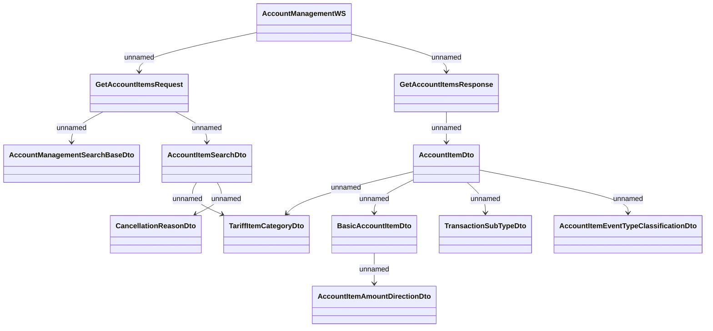

# Account ManagementWS - Account items

```mermaid
classDiagram
    class CancellationReasonDto["CancellationReasonDto"]
    class GetAccountItemsResponse["GetAccountItemsResponse"]
    class AccountItemDto["AccountItemDto"]
    class BasicAccountItemDto["BasicAccountItemDto"]
    class TransactionSubTypeDto["TransactionSubTypeDto"]
    class AccountItemAmountDirectionDto["AccountItemAmountDirectionDto"]
    class TariffItemCategoryDto["TariffItemCategoryDto"]
    class AccountItemEventTypeClassificationDto["AccountItemEventTypeClassificationDto"]
    class AccountItemSearchDto["AccountItemSearchDto"]
    class AccountManagementSearchBaseDto["AccountManagementSearchBaseDto"]
    class GetAccountItemsRequest["GetAccountItemsRequest"]
    class AccountManagementWS["AccountManagementWS"]
    AccountManagementWS --> GetAccountItemsRequest : unnamed
    GetAccountItemsRequest --> AccountManagementSearchBaseDto : unnamed
    GetAccountItemsRequest --> AccountItemSearchDto : unnamed
    AccountItemSearchDto --> TariffItemCategoryDto : unnamed
    BasicAccountItemDto --> AccountItemAmountDirectionDto : unnamed
    GetAccountItemsResponse --> AccountItemDto : unnamed
    AccountManagementWS --> GetAccountItemsResponse : unnamed
    AccountItemSearchDto --> CancellationReasonDto : unnamed
    AccountItemDto --> TariffItemCategoryDto : unnamed
    AccountItemDto --> BasicAccountItemDto : unnamed
    AccountItemDto --> TransactionSubTypeDto : unnamed
    AccountItemDto --> AccountItemEventTypeClassificationDto : unnamed
```
