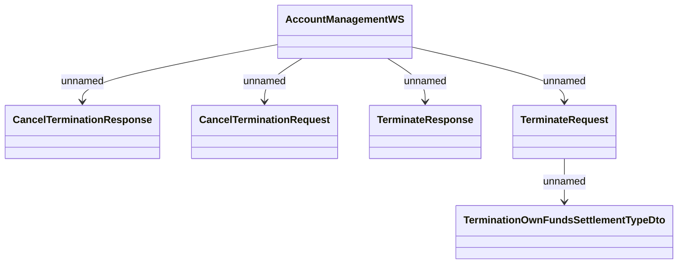

# Account ManagementWS - Account termination

```mermaid
classDiagram
    class TerminationOwnFundsSettlementTypeDto["TerminationOwnFundsSettlementTypeDto"]
    class AccountManagementWS["AccountManagementWS"]
    class CancelTerminationResponse["CancelTerminationResponse"]
    class CancelTerminationRequest["CancelTerminationRequest"]
    class TerminateResponse["TerminateResponse"]
    class TerminateRequest["TerminateRequest"]
    AccountManagementWS --> TerminateRequest : unnamed
    AccountManagementWS --> TerminateResponse : unnamed
    AccountManagementWS --> CancelTerminationRequest : unnamed
    AccountManagementWS --> CancelTerminationResponse : unnamed
    TerminateRequest --> TerminationOwnFundsSettlementTypeDto : unnamed
```
