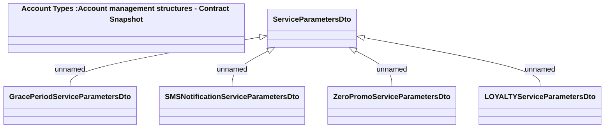

# Account management structures  - Service Parameters

- **Diagram Type**: Logical
- **Package**: HomerSelect/BSL/Analysis Model/_Interface/Consumed services/Payment Card system/Account/Account Management/AccountManagementWS (v2)/Account Management - Structures
- **Diagram ID**: 158214
- **Elements**: 6
- **Connectors**: 4

