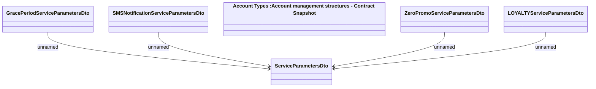

# Account management structures  - Service Parameters

```mermaid
classDiagram
    class LOYALTYServiceParametersDto["LOYALTYServiceParametersDto"]
    class ZeroPromoServiceParametersDto["ZeroPromoServiceParametersDto"]
    class Account_Types_Account_management_structures_Contract_Snapsho["Account Types :Account management structures - Contract Snapshot"]
    class SMSNotificationServiceParametersDto["SMSNotificationServiceParametersDto"]
    class GracePeriodServiceParametersDto["GracePeriodServiceParametersDto"]
    class ServiceParametersDto["ServiceParametersDto"]
    GracePeriodServiceParametersDto --> ServiceParametersDto : unnamed
    SMSNotificationServiceParametersDto --> ServiceParametersDto : unnamed
    ZeroPromoServiceParametersDto --> ServiceParametersDto : unnamed
    LOYALTYServiceParametersDto --> ServiceParametersDto : unnamed
```
