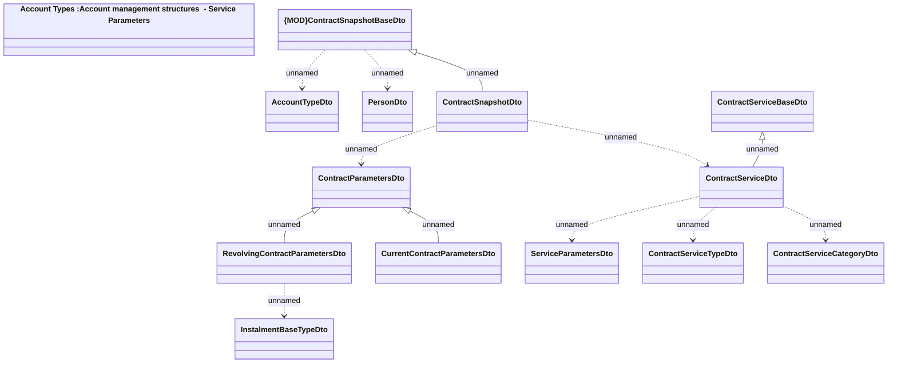

# Account management structures - Contract Snapshot

- **Diagram Type**: Logical
- **Package**: HomerSelect/BSL/Analysis Model/_Interface/Consumed services/Payment Card system/Account/Account Management/AccountManagementWS (v2)/Account Management - Structures
- **Diagram ID**: 158213
- **Elements**: 14
- **Connectors**: 12

