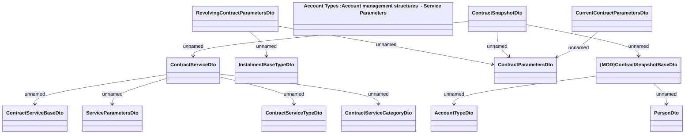

# Account management structures - Contract Snapshot

```mermaid
classDiagram
    class CurrentContractParametersDto["CurrentContractParametersDto"]
    class Account_Types_Account_management_structures_Service_Paramete["Account Types :Account management structures  - Service Parameters"]
    class ContractServiceCategoryDto["ContractServiceCategoryDto"]
    class ContractServiceTypeDto["ContractServiceTypeDto"]
    class ContractServiceDto["ContractServiceDto"]
    class ContractSnapshotDto["ContractSnapshotDto"]
    class InstalmentBaseTypeDto["InstalmentBaseTypeDto"]
    class AccountTypeDto["AccountTypeDto"]
    class PersonDto["PersonDto"]
    class ServiceParametersDto["ServiceParametersDto"]
    class ContractServiceBaseDto["ContractServiceBaseDto"]
    class RevolvingContractParametersDto["RevolvingContractParametersDto"]
    class ContractParametersDto["ContractParametersDto"]
    class MOD_ContractSnapshotBaseDto["{MOD}ContractSnapshotBaseDto"]
    MOD_ContractSnapshotBaseDto --> AccountTypeDto : unnamed
    MOD_ContractSnapshotBaseDto --> PersonDto : unnamed
    RevolvingContractParametersDto --> ContractParametersDto : unnamed
    RevolvingContractParametersDto --> InstalmentBaseTypeDto : unnamed
    ContractSnapshotDto --> ContractParametersDto : unnamed
    ContractSnapshotDto --> ContractServiceDto : unnamed
    ContractSnapshotDto --> MOD_ContractSnapshotBaseDto : unnamed
    ContractServiceDto --> ContractServiceBaseDto : unnamed
    ContractServiceDto --> ServiceParametersDto : unnamed
    ContractServiceDto --> ContractServiceTypeDto : unnamed
    ContractServiceDto --> ContractServiceCategoryDto : unnamed
    CurrentContractParametersDto --> ContractParametersDto : unnamed
```
