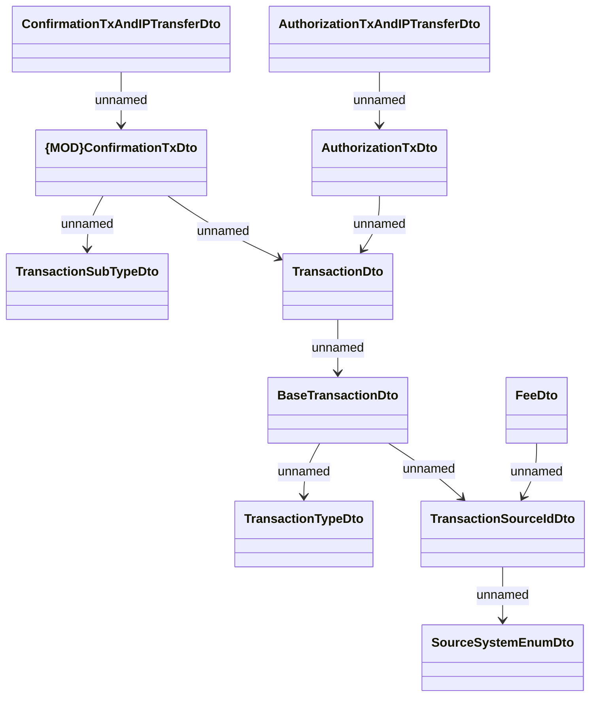

# Account management structures - Initial Transaction

```mermaid
classDiagram
    class ConfirmationTxAndIPTransferDto["ConfirmationTxAndIPTransferDto"]
    class AuthorizationTxAndIPTransferDto["AuthorizationTxAndIPTransferDto"]
    class TransactionTypeDto["TransactionTypeDto"]
    class FeeDto["FeeDto"]
    class AuthorizationTxDto["AuthorizationTxDto"]
    class TransactionSubTypeDto["TransactionSubTypeDto"]
    class SourceSystemEnumDto["SourceSystemEnumDto"]
    class MOD_ConfirmationTxDto["{MOD}ConfirmationTxDto"]
    class TransactionDto["TransactionDto"]
    class BaseTransactionDto["BaseTransactionDto"]
    class TransactionSourceIdDto["TransactionSourceIdDto"]
    TransactionSourceIdDto --> SourceSystemEnumDto : unnamed
    BaseTransactionDto --> TransactionTypeDto : unnamed
    BaseTransactionDto --> TransactionSourceIdDto : unnamed
    TransactionDto --> BaseTransactionDto : unnamed
    MOD_ConfirmationTxDto --> TransactionDto : unnamed
    MOD_ConfirmationTxDto --> TransactionSubTypeDto : unnamed
    AuthorizationTxDto --> TransactionDto : unnamed
    FeeDto --> TransactionSourceIdDto : unnamed
    AuthorizationTxAndIPTransferDto --> AuthorizationTxDto : unnamed
    ConfirmationTxAndIPTransferDto --> MOD_ConfirmationTxDto : unnamed
```
