# Account management structures

- **Diagram Type**: Logical
- **Package**: HomerSelect/BSL/Analysis Model/_Interface/Consumed services/Payment Card system/Account/Account Management/AccountManagementWS (v2)/Account Management - Structures
- **Diagram ID**: 158211
- **Elements**: 34
- **Connectors**: 21

```mermaid
classDiagram
    class ADD_CommodityDto["{ADD}CommodityDto"]
    class TransactionAuthorizationDto["TransactionAuthorizationDto"]
    class DailyBalanceDto["DailyBalanceDto"]
    class BlockingReasonCodeType["BlockingReasonCodeType"]
    class TerminationOwnFundsSettlementTypeDto["TerminationOwnFundsSettlementTypeDto"]
    class CurrentContractParametersDto["CurrentContractParametersDto"]
    class AccountHistoryDto["AccountHistoryDto"]
    class AuthorizationModeDto["AuthorizationModeDto"]
    class AccountStatusDto["AccountStatusDto"]
    class StaticDataReferenceDto["StaticDataReferenceDto"]
    class PropertySearchDto["PropertySearchDto"]
    class PropertyDto["PropertyDto"]
    class MoneyDto["MoneyDto"]
    class DateRangeDto["DateRangeDto"]
    class AccountTypeDto["AccountTypeDto"]
    class PayoffReasonCodeDto["PayoffReasonCodeDto"]
    class AccountSearchDto["AccountSearchDto"]
    class MOD_ConfirmationTxDto["{MOD}ConfirmationTxDto"]
    class AuthorizationTxDto["AuthorizationTxDto"]
    class TransactionDto["TransactionDto"]
    class BaseTransactionDto["BaseTransactionDto"]
    class TransactionSourceIdDto["TransactionSourceIdDto"]
    class AccountBalanceDto["AccountBalanceDto"]
    class BalanceDto["BalanceDto"]
    class PersonDto["PersonDto"]
    class ServiceParametersDto["ServiceParametersDto"]
    class ContractServiceBaseDto["ContractServiceBaseDto"]
    class RevolvingContractParametersDto["RevolvingContractParametersDto"]
    class ContractParametersDto["ContractParametersDto"]
    class MOD_ContractSnapshotBaseDto["{MOD}ContractSnapshotBaseDto"]
    class BlockingReasonDto["BlockingReasonDto"]
    class AccountListDto["AccountListDto"]
    class AccountDetailsDto["AccountDetailsDto"]
    class AccountDto["AccountDto"]
    BalanceDto <|-- AccountBalanceDto : unnamed
    ContractParametersDto <|-- CurrentContractParametersDto : unnamed
    AccountDto <|-- AccountHistoryDto : unnamed
    AccountSearchDto ..> AccountStatusDto : unnamed
    AccountSearchDto ..> AccountTypeDto : unnamed
    TransactionDto <|-- MOD_ConfirmationTxDto : unnamed
    MOD_ConfirmationTxDto ..> ADD_CommodityDto : unnamed
    AuthorizationTxDto ..> AuthorizationModeDto : unnamed
    TransactionDto <|-- AuthorizationTxDto : unnamed
    TransactionAuthorizationDto ..> TransactionSourceIdDto : unnamed
    BaseTransactionDto ..> TransactionSourceIdDto : unnamed
    AccountDto ..> AccountTypeDto : unnamed
    ContractParametersDto <|-- RevolvingContractParametersDto : unnamed
    MOD_ContractSnapshotBaseDto ..> PersonDto : unnamed
    MOD_ContractSnapshotBaseDto ..> AccountTypeDto : unnamed
    BlockingReasonDto ..> BlockingReasonCodeType : unnamed
    AccountListDto --> AccountDto : unnamed
    AccountDetailsDto --> MOD_ContractSnapshotBaseDto : unnamed
    AccountDto <|-- AccountDetailsDto : unnamed
    AccountDto ..> AccountStatusDto : unnamed
    BaseTransactionDto <|-- TransactionDto : unnamed
```

