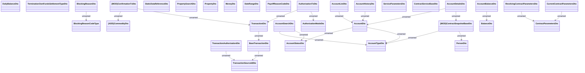

# Account management structures

```mermaid
classDiagram
    class ADD_CommodityDto["{ADD}CommodityDto"]
    class TransactionAuthorizationDto["TransactionAuthorizationDto"]
    class DailyBalanceDto["DailyBalanceDto"]
    class BlockingReasonCodeType["BlockingReasonCodeType"]
    class TerminationOwnFundsSettlementTypeDto["TerminationOwnFundsSettlementTypeDto"]
    class CurrentContractParametersDto["CurrentContractParametersDto"]
    class AccountHistoryDto["AccountHistoryDto"]
    class AuthorizationModeDto["AuthorizationModeDto"]
    class AccountStatusDto["AccountStatusDto"]
    class StaticDataReferenceDto["StaticDataReferenceDto"]
    class PropertySearchDto["PropertySearchDto"]
    class PropertyDto["PropertyDto"]
    class MoneyDto["MoneyDto"]
    class DateRangeDto["DateRangeDto"]
    class AccountTypeDto["AccountTypeDto"]
    class PayoffReasonCodeDto["PayoffReasonCodeDto"]
    class AccountSearchDto["AccountSearchDto"]
    class MOD_ConfirmationTxDto["{MOD}ConfirmationTxDto"]
    class AuthorizationTxDto["AuthorizationTxDto"]
    class TransactionDto["TransactionDto"]
    class BaseTransactionDto["BaseTransactionDto"]
    class TransactionSourceIdDto["TransactionSourceIdDto"]
    class AccountBalanceDto["AccountBalanceDto"]
    class BalanceDto["BalanceDto"]
    class PersonDto["PersonDto"]
    class ServiceParametersDto["ServiceParametersDto"]
    class ContractServiceBaseDto["ContractServiceBaseDto"]
    class RevolvingContractParametersDto["RevolvingContractParametersDto"]
    class ContractParametersDto["ContractParametersDto"]
    class MOD_ContractSnapshotBaseDto["{MOD}ContractSnapshotBaseDto"]
    class BlockingReasonDto["BlockingReasonDto"]
    class AccountListDto["AccountListDto"]
    class AccountDetailsDto["AccountDetailsDto"]
    class AccountDto["AccountDto"]
    AccountBalanceDto --> BalanceDto : unnamed
    CurrentContractParametersDto --> ContractParametersDto : unnamed
    AccountHistoryDto --> AccountDto : unnamed
    AccountSearchDto --> AccountStatusDto : unnamed
    AccountSearchDto --> AccountTypeDto : unnamed
    MOD_ConfirmationTxDto --> TransactionDto : unnamed
    MOD_ConfirmationTxDto --> ADD_CommodityDto : unnamed
    AuthorizationTxDto --> AuthorizationModeDto : unnamed
    AuthorizationTxDto --> TransactionDto : unnamed
    TransactionAuthorizationDto --> TransactionSourceIdDto : unnamed
    BaseTransactionDto --> TransactionSourceIdDto : unnamed
    AccountDto --> AccountTypeDto : unnamed
    RevolvingContractParametersDto --> ContractParametersDto : unnamed
    MOD_ContractSnapshotBaseDto --> PersonDto : unnamed
    MOD_ContractSnapshotBaseDto --> AccountTypeDto : unnamed
    BlockingReasonDto --> BlockingReasonCodeType : unnamed
    AccountListDto --> AccountDto : unnamed
    AccountDetailsDto --> MOD_ContractSnapshotBaseDto : unnamed
    AccountDetailsDto --> AccountDto : unnamed
    AccountDto --> AccountStatusDto : unnamed
    TransactionDto --> BaseTransactionDto : unnamed
```
