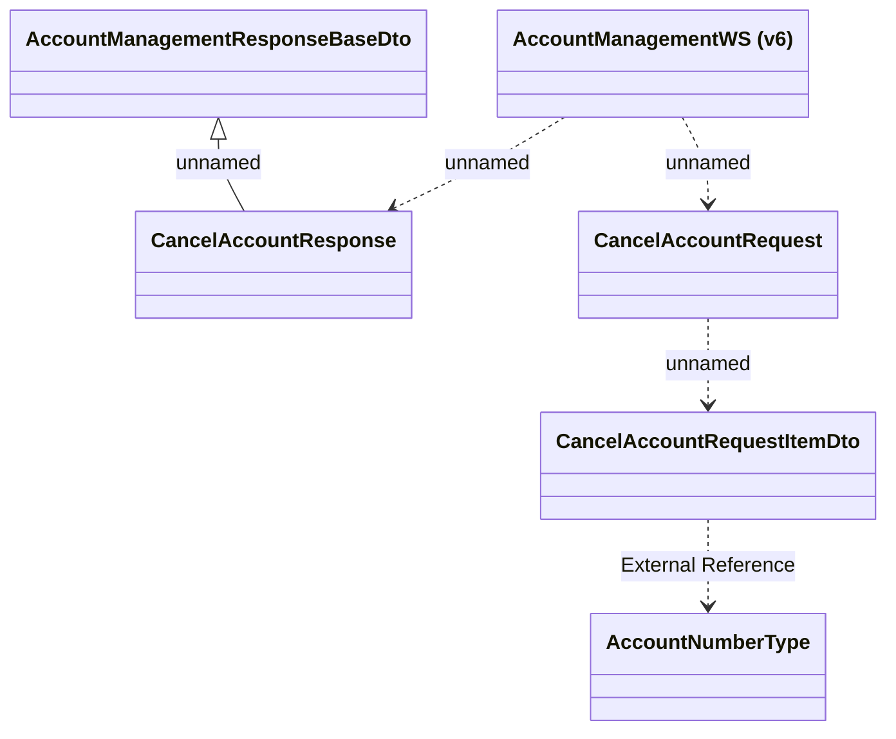

# AccountManagementWS (v6) - CancelAccount

- **Diagram Type**: Logical
- **Package**: HomerSelect/BSL/Analysis Model/_Interface/Consumed services/Payment Card system/Account/Account Management/AccountManagementWS (v6)
- **Diagram ID**: 145913
- **Elements**: 6
- **Connectors**: 5

