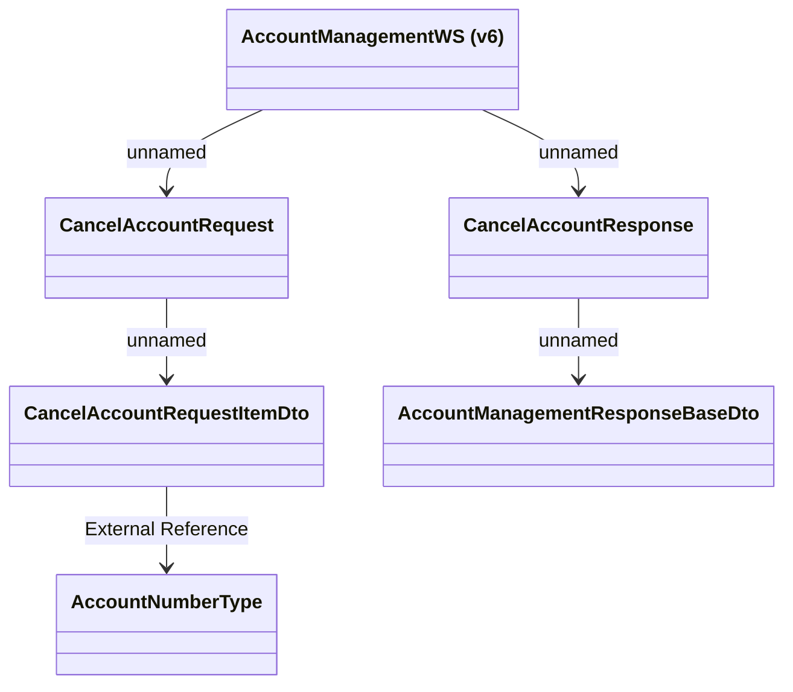

# AccountManagementWS (v6) - CancelAccount

```mermaid
classDiagram
    class CancelAccountRequestItemDto["CancelAccountRequestItemDto"]
    class CancelAccountResponse["CancelAccountResponse"]
    class CancelAccountRequest["CancelAccountRequest"]
    class AccountNumberType["AccountNumberType"]
    class AccountManagementResponseBaseDto["AccountManagementResponseBaseDto"]
    class AccountManagementWS_v6["AccountManagementWS (v6)"]
    AccountManagementWS_v6 --> CancelAccountResponse : unnamed
    AccountManagementWS_v6 --> CancelAccountRequest : unnamed
    CancelAccountRequest --> CancelAccountRequestItemDto : unnamed
    CancelAccountResponse --> AccountManagementResponseBaseDto : unnamed
    CancelAccountRequestItemDto --> AccountNumberType : External Reference
```
