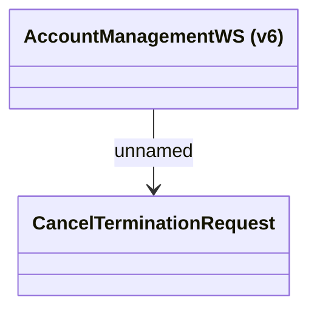

# AccountManagementWS (v6) - CancelTermination

```mermaid
classDiagram
    class CancelTerminationRequest["CancelTerminationRequest"]
    class AccountManagementWS_v6["AccountManagementWS (v6)"]
    AccountManagementWS_v6 --> CancelTerminationRequest : unnamed
```
