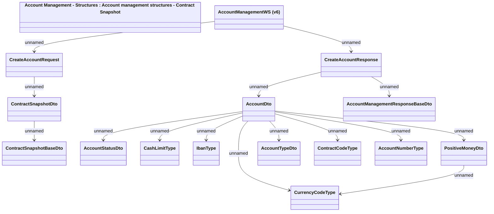

# AccountManagementWS (v6) - CreateAccount

```mermaid
classDiagram
    class ContractSnapshotBaseDto["ContractSnapshotBaseDto"]
    class Account_Management_Structures_Account_management_structures_["Account Management - Structures : Account management structures - Contract Snapshot"]
    class ContractSnapshotDto["ContractSnapshotDto"]
    class CreateAccountResponse["CreateAccountResponse"]
    class CreateAccountRequest["CreateAccountRequest"]
    class AccountStatusDto["AccountStatusDto"]
    class CashLimitType["CashLimitType"]
    class CurrencyCodeType["CurrencyCodeType"]
    class IbanType["IbanType"]
    class PositiveMoneyDto["PositiveMoneyDto"]
    class AccountTypeDto["AccountTypeDto"]
    class ContractCodeType["ContractCodeType"]
    class AccountDto["AccountDto"]
    class AccountNumberType["AccountNumberType"]
    class AccountManagementResponseBaseDto["AccountManagementResponseBaseDto"]
    class AccountManagementWS_v6["AccountManagementWS (v6)"]
    AccountManagementWS_v6 --> CreateAccountRequest : unnamed
    AccountManagementWS_v6 --> CreateAccountResponse : unnamed
    AccountDto --> AccountStatusDto : unnamed
    AccountDto --> CashLimitType : unnamed
    AccountDto --> AccountNumberType : unnamed
    AccountDto --> IbanType : unnamed
    AccountDto --> ContractCodeType : unnamed
    AccountDto --> CurrencyCodeType : unnamed
    AccountDto --> PositiveMoneyDto : unnamed
    AccountDto --> AccountTypeDto : unnamed
    PositiveMoneyDto --> CurrencyCodeType : unnamed
    CreateAccountRequest --> ContractSnapshotDto : unnamed
    CreateAccountResponse --> AccountManagementResponseBaseDto : unnamed
    CreateAccountResponse --> AccountDto : unnamed
    ContractSnapshotDto --> ContractSnapshotBaseDto : unnamed
```
