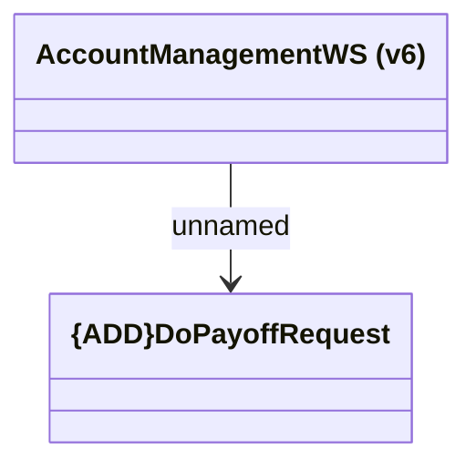

# AccountManagementWS (v6) - DoPayOff

```mermaid
classDiagram
    class ADD_DoPayoffRequest["{ADD}DoPayoffRequest"]
    class AccountManagementWS_v6["AccountManagementWS (v6)"]
    AccountManagementWS_v6 --> ADD_DoPayoffRequest : unnamed
```
