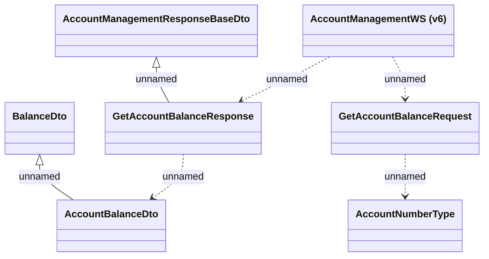

# AccountManagementWS (v6) - GetAccountBalance

- **Diagram Type**: Logical
- **Package**: HomerSelect/BSL/Analysis Model/_Interface/Consumed services/Payment Card system/Account/Account Management/AccountManagementWS (v6)
- **Diagram ID**: 145911
- **Elements**: 7
- **Connectors**: 6

