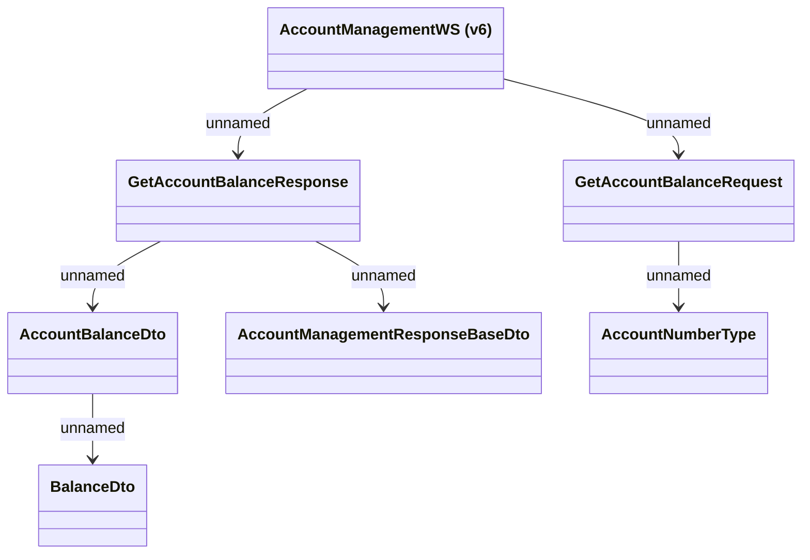

# AccountManagementWS (v6) - GetAccountBalance

```mermaid
classDiagram
    class BalanceDto["BalanceDto"]
    class AccountBalanceDto["AccountBalanceDto"]
    class AccountManagementResponseBaseDto["AccountManagementResponseBaseDto"]
    class AccountNumberType["AccountNumberType"]
    class GetAccountBalanceResponse["GetAccountBalanceResponse"]
    class GetAccountBalanceRequest["GetAccountBalanceRequest"]
    class AccountManagementWS_v6["AccountManagementWS (v6)"]
    AccountManagementWS_v6 --> GetAccountBalanceResponse : unnamed
    AccountManagementWS_v6 --> GetAccountBalanceRequest : unnamed
    GetAccountBalanceRequest --> AccountNumberType : unnamed
    GetAccountBalanceResponse --> AccountManagementResponseBaseDto : unnamed
    GetAccountBalanceResponse --> AccountBalanceDto : unnamed
    AccountBalanceDto --> BalanceDto : unnamed
```
