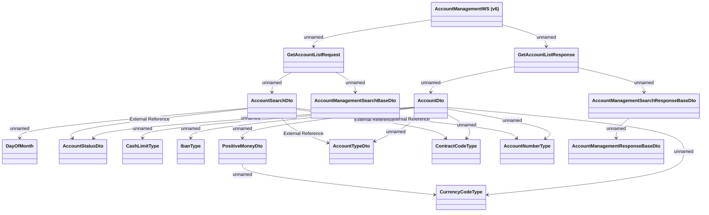

# AccountManagementWS (v6) - GetAccountList

```mermaid
classDiagram
    class DayOfMonth["DayOfMonth"]
    class AccountSearchDto["AccountSearchDto"]
    class AccountManagementSearchBaseDto["AccountManagementSearchBaseDto"]
    class AccountManagementSearchResponseBaseDto["AccountManagementSearchResponseBaseDto"]
    class AccountStatusDto["AccountStatusDto"]
    class CashLimitType["CashLimitType"]
    class CurrencyCodeType["CurrencyCodeType"]
    class IbanType["IbanType"]
    class PositiveMoneyDto["PositiveMoneyDto"]
    class AccountTypeDto["AccountTypeDto"]
    class ContractCodeType["ContractCodeType"]
    class AccountDto["AccountDto"]
    class AccountNumberType["AccountNumberType"]
    class AccountManagementResponseBaseDto["AccountManagementResponseBaseDto"]
    class GetAccountListResponse["GetAccountListResponse"]
    class GetAccountListRequest["GetAccountListRequest"]
    class AccountManagementWS_v6["AccountManagementWS (v6)"]
    AccountDto --> IbanType : unnamed
    AccountSearchDto --> AccountTypeDto : External Reference
    AccountSearchDto --> AccountNumberType : External Reference
    AccountSearchDto --> DayOfMonth : unnamed
    AccountSearchDto --> AccountStatusDto : External Reference
    AccountManagementSearchResponseBaseDto --> AccountManagementResponseBaseDto : unnamed
    PositiveMoneyDto --> CurrencyCodeType : unnamed
    AccountDto --> AccountTypeDto : unnamed
    AccountDto --> PositiveMoneyDto : unnamed
    AccountSearchDto --> ContractCodeType : External Reference
    AccountDto --> ContractCodeType : unnamed
    AccountManagementWS_v6 --> GetAccountListResponse : unnamed
    AccountDto --> AccountNumberType : unnamed
    AccountDto --> CashLimitType : unnamed
    AccountDto --> AccountStatusDto : unnamed
    GetAccountListResponse --> AccountManagementSearchResponseBaseDto : unnamed
    GetAccountListResponse --> AccountDto : unnamed
    GetAccountListRequest --> AccountManagementSearchBaseDto : unnamed
    GetAccountListRequest --> AccountSearchDto : unnamed
    AccountManagementWS_v6 --> GetAccountListRequest : unnamed
    AccountDto --> CurrencyCodeType : unnamed
```
