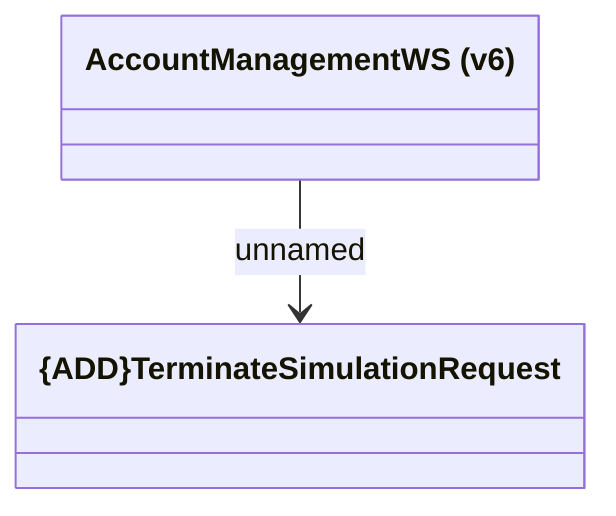

# AccountManagementWS (v6) - TerminateSimulation

```mermaid
classDiagram
    class ADD_TerminateSimulationRequest["{ADD}TerminateSimulationRequest"]
    class AccountManagementWS_v6["AccountManagementWS (v6)"]
    AccountManagementWS_v6 --> ADD_TerminateSimulationRequest : unnamed
```
