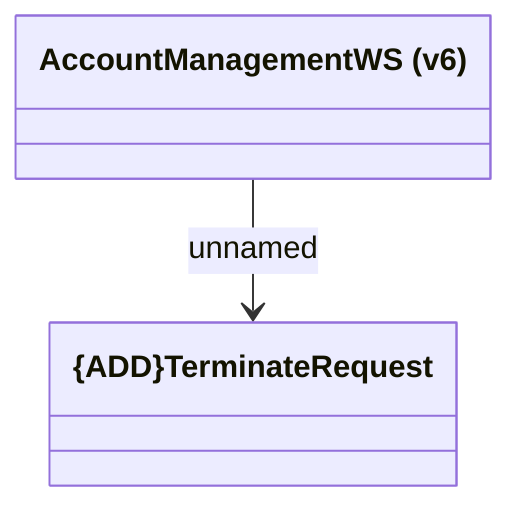

# AccountManagementWS (v6) - Terminate

```mermaid
classDiagram
    class ADD_TerminateRequest["{ADD}TerminateRequest"]
    class AccountManagementWS_v6["AccountManagementWS (v6)"]
    AccountManagementWS_v6 --> ADD_TerminateRequest : unnamed
```
