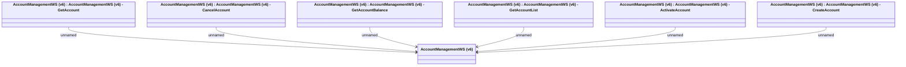

# AccountManagementWS (v6)

```mermaid
classDiagram
    class AccountManagementWS_v6_AccountManagementWS_v6_CreateAccount["AccountManagementWS (v6) : AccountManagementWS (v6) - CreateAccount"]
    class AccountManagementWS_v6_AccountManagementWS_v6_ActivateAccoun["AccountManagementWS (v6) : AccountManagementWS (v6) - ActivateAccount"]
    class AccountManagementWS_v6_AccountManagementWS_v6_GetAccountList["AccountManagementWS (v6) : AccountManagementWS (v6) - GetAccountList"]
    class AccountManagementWS_v6_AccountManagementWS_v6_GetAccountBala["AccountManagementWS (v6) : AccountManagementWS (v6) - GetAccountBalance"]
    class AccountManagementWS_v6_AccountManagementWS_v6_CancelAccount["AccountManagementWS (v6) : AccountManagementWS (v6) - CancelAccount"]
    class AccountManagementWS_v6_AccountManagementWS_v6_GetAccount["AccountManagementWS (v6) : AccountManagementWS (v6) - GetAccount"]
    class AccountManagementWS_v6["AccountManagementWS (v6)"]
    AccountManagementWS_v6_AccountManagementWS_v6_GetAccount --> AccountManagementWS_v6 : unnamed
    AccountManagementWS_v6_AccountManagementWS_v6_CancelAccount --> AccountManagementWS_v6 : unnamed
    AccountManagementWS_v6_AccountManagementWS_v6_GetAccountBala --> AccountManagementWS_v6 : unnamed
    AccountManagementWS_v6_AccountManagementWS_v6_GetAccountList --> AccountManagementWS_v6 : unnamed
    AccountManagementWS_v6_AccountManagementWS_v6_ActivateAccoun --> AccountManagementWS_v6 : unnamed
    AccountManagementWS_v6_AccountManagementWS_v6_CreateAccount --> AccountManagementWS_v6 : unnamed
```
