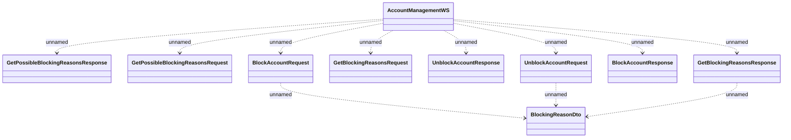

# AccountManagementWS - Account blocking

- **Diagram Type**: Logical
- **Package**: HomerSelect/BSL/Analysis Model/_Interface/Consumed services/Payment Card system/Account/Account Management/AccountManagementWS (v2)
- **Diagram ID**: 136834
- **Elements**: 10
- **Connectors**: 11

