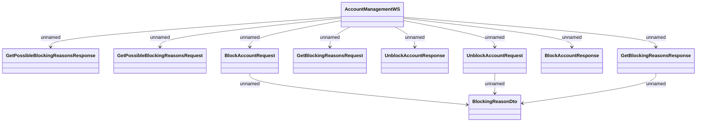

# AccountManagementWS - Account blocking

```mermaid
classDiagram
    class GetPossibleBlockingReasonsResponse["GetPossibleBlockingReasonsResponse"]
    class GetPossibleBlockingReasonsRequest["GetPossibleBlockingReasonsRequest"]
    class BlockingReasonDto["BlockingReasonDto"]
    class AccountManagementWS["AccountManagementWS"]
    class GetBlockingReasonsResponse["GetBlockingReasonsResponse"]
    class GetBlockingReasonsRequest["GetBlockingReasonsRequest"]
    class UnblockAccountResponse["UnblockAccountResponse"]
    class UnblockAccountRequest["UnblockAccountRequest"]
    class BlockAccountResponse["BlockAccountResponse"]
    class BlockAccountRequest["BlockAccountRequest"]
    AccountManagementWS --> BlockAccountRequest : unnamed
    AccountManagementWS --> BlockAccountResponse : unnamed
    AccountManagementWS --> UnblockAccountRequest : unnamed
    AccountManagementWS --> UnblockAccountResponse : unnamed
    AccountManagementWS --> GetBlockingReasonsRequest : unnamed
    AccountManagementWS --> GetBlockingReasonsResponse : unnamed
    BlockAccountRequest --> BlockingReasonDto : unnamed
    UnblockAccountRequest --> BlockingReasonDto : unnamed
    GetBlockingReasonsResponse --> BlockingReasonDto : unnamed
    AccountManagementWS --> GetPossibleBlockingReasonsRequest : unnamed
    AccountManagementWS --> GetPossibleBlockingReasonsResponse : unnamed
```
