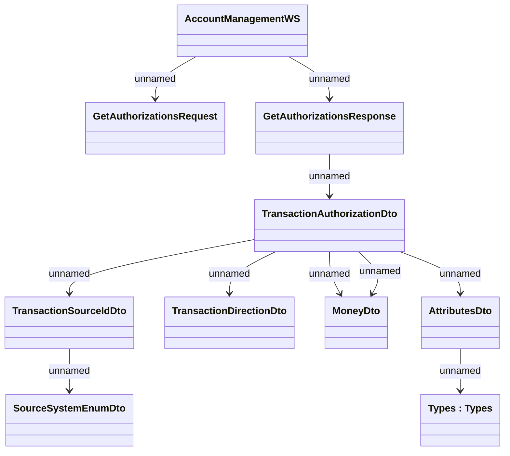

# AccountManagementWS - Authorization

```mermaid
classDiagram
    class AccountManagementWS["AccountManagementWS"]
    class Types_Types["Types : Types"]
    class AttributesDto["AttributesDto"]
    class GetAuthorizationsRequest["GetAuthorizationsRequest"]
    class TransactionDirectionDto["TransactionDirectionDto"]
    class SourceSystemEnumDto["SourceSystemEnumDto"]
    class MoneyDto["MoneyDto"]
    class TransactionSourceIdDto["TransactionSourceIdDto"]
    class TransactionAuthorizationDto["TransactionAuthorizationDto"]
    class GetAuthorizationsResponse["GetAuthorizationsResponse"]
    AccountManagementWS --> GetAuthorizationsResponse : unnamed
    GetAuthorizationsResponse --> TransactionAuthorizationDto : unnamed
    AccountManagementWS --> GetAuthorizationsRequest : unnamed
    AttributesDto --> Types_Types : unnamed
    TransactionSourceIdDto --> SourceSystemEnumDto : unnamed
    TransactionAuthorizationDto --> TransactionDirectionDto : unnamed
    TransactionAuthorizationDto --> TransactionSourceIdDto : unnamed
    TransactionAuthorizationDto --> AttributesDto : unnamed
    TransactionAuthorizationDto --> MoneyDto : unnamed
    TransactionAuthorizationDto --> MoneyDto : unnamed
```
