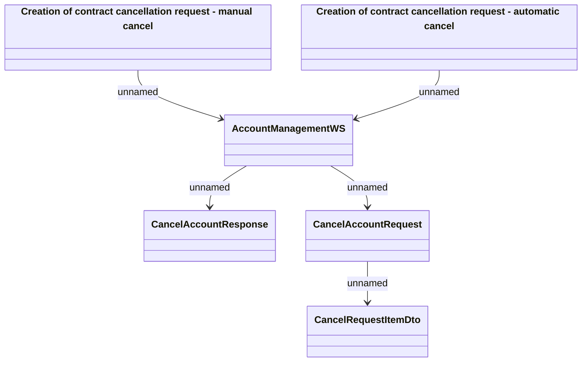

# AccountManagementWS - Contract cancellation

```mermaid
classDiagram
    class Creation_of_contract_cancellation_request_automatic_cancel["Creation of contract cancellation request - automatic cancel"]
    class Creation_of_contract_cancellation_request_manual_cancel["Creation of contract cancellation request - manual cancel"]
    class CancelRequestItemDto["CancelRequestItemDto"]
    class CancelAccountResponse["CancelAccountResponse"]
    class CancelAccountRequest["CancelAccountRequest"]
    class AccountManagementWS["AccountManagementWS"]
    AccountManagementWS --> CancelAccountRequest : unnamed
    AccountManagementWS --> CancelAccountResponse : unnamed
    CancelAccountRequest --> CancelRequestItemDto : unnamed
    Creation_of_contract_cancellation_request_manual_cancel --> AccountManagementWS : unnamed
    Creation_of_contract_cancellation_request_automatic_cancel --> AccountManagementWS : unnamed
```
