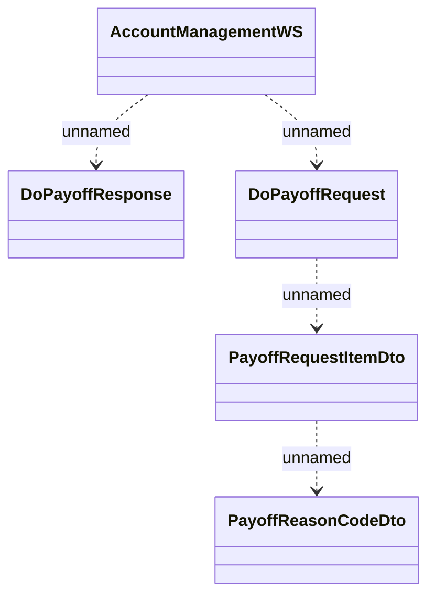

# AccountManagementWS - Contract payoff

- **Diagram Type**: Logical
- **Package**: HomerSelect/BSL/Analysis Model/_Interface/Consumed services/Payment Card system/Account/Account Management/AccountManagementWS (v2)
- **Diagram ID**: 136830
- **Elements**: 5
- **Connectors**: 4

