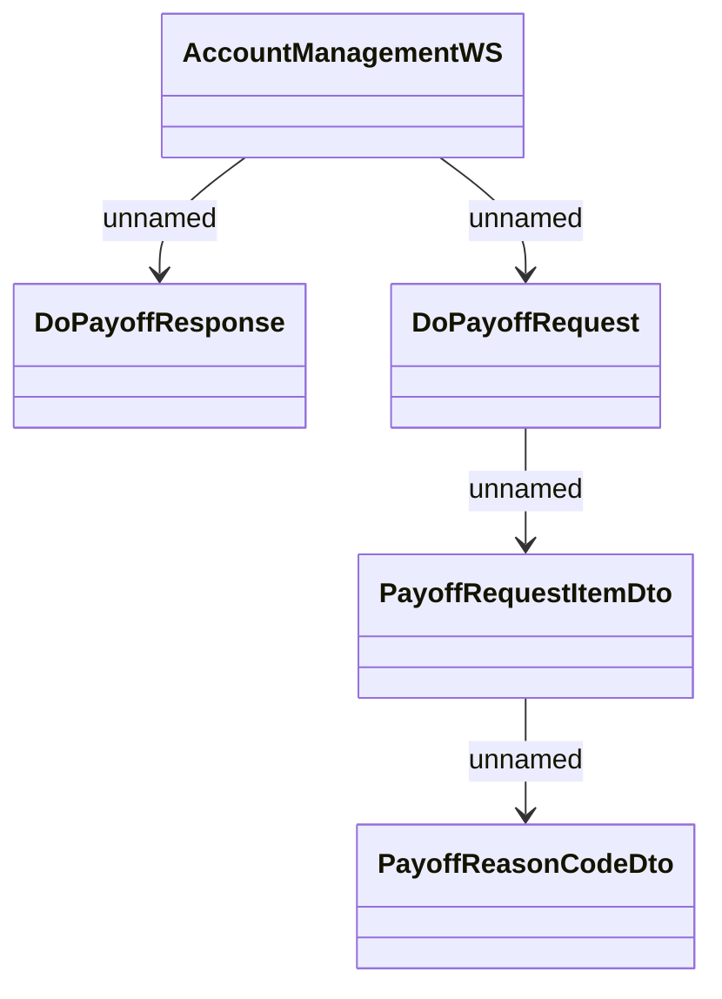

# AccountManagementWS - Contract payoff

```mermaid
classDiagram
    class PayoffRequestItemDto["PayoffRequestItemDto"]
    class PayoffReasonCodeDto["PayoffReasonCodeDto"]
    class DoPayoffResponse["DoPayoffResponse"]
    class DoPayoffRequest["DoPayoffRequest"]
    class AccountManagementWS["AccountManagementWS"]
    AccountManagementWS --> DoPayoffRequest : unnamed
    AccountManagementWS --> DoPayoffResponse : unnamed
    DoPayoffRequest --> PayoffRequestItemDto : unnamed
    PayoffRequestItemDto --> PayoffReasonCodeDto : unnamed
```
