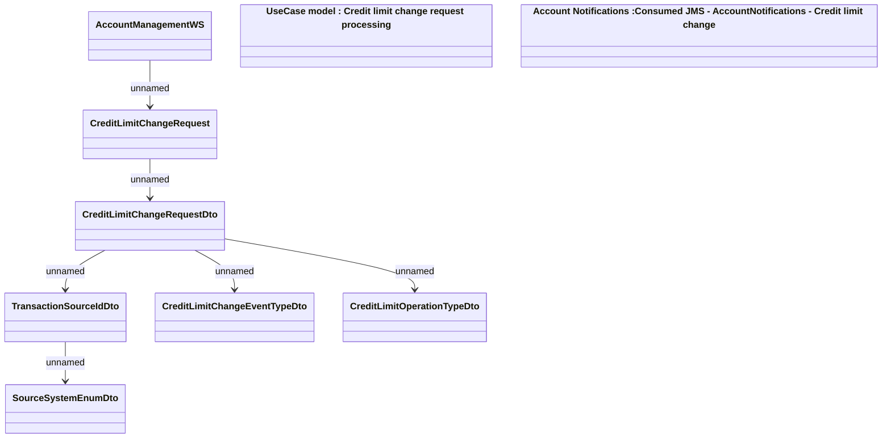

# AccountManagementWS - Credit limit change request

```mermaid
classDiagram
    class AccountManagementWS["AccountManagementWS"]
    class UseCase_model_Credit_limit_change_request_processing["UseCase model : Credit limit change request processing"]
    class Account_Notifications_Consumed_JMS_AccountNotifications_Cred["Account Notifications :Consumed JMS - AccountNotifications - Credit limit change"]
    class SourceSystemEnumDto["SourceSystemEnumDto"]
    class TransactionSourceIdDto["TransactionSourceIdDto"]
    class CreditLimitChangeEventTypeDto["CreditLimitChangeEventTypeDto"]
    class CreditLimitOperationTypeDto["CreditLimitOperationTypeDto"]
    class CreditLimitChangeRequestDto["CreditLimitChangeRequestDto"]
    class CreditLimitChangeRequest["CreditLimitChangeRequest"]
    AccountManagementWS --> CreditLimitChangeRequest : unnamed
    CreditLimitChangeRequest --> CreditLimitChangeRequestDto : unnamed
    TransactionSourceIdDto --> SourceSystemEnumDto : unnamed
    CreditLimitChangeRequestDto --> CreditLimitOperationTypeDto : unnamed
    CreditLimitChangeRequestDto --> CreditLimitChangeEventTypeDto : unnamed
    CreditLimitChangeRequestDto --> TransactionSourceIdDto : unnamed
```
