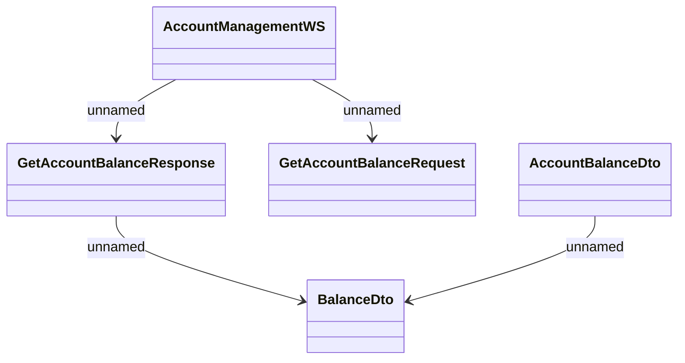

# AccountManagementWS - GetAccountBalance

```mermaid
classDiagram
    class AccountBalanceDto["AccountBalanceDto"]
    class BalanceDto["BalanceDto"]
    class GetAccountBalanceRequest["GetAccountBalanceRequest"]
    class GetAccountBalanceResponse["GetAccountBalanceResponse"]
    class AccountManagementWS["AccountManagementWS"]
    AccountManagementWS --> GetAccountBalanceResponse : unnamed
    AccountManagementWS --> GetAccountBalanceRequest : unnamed
    GetAccountBalanceResponse --> BalanceDto : unnamed
    AccountBalanceDto --> BalanceDto : unnamed
```
