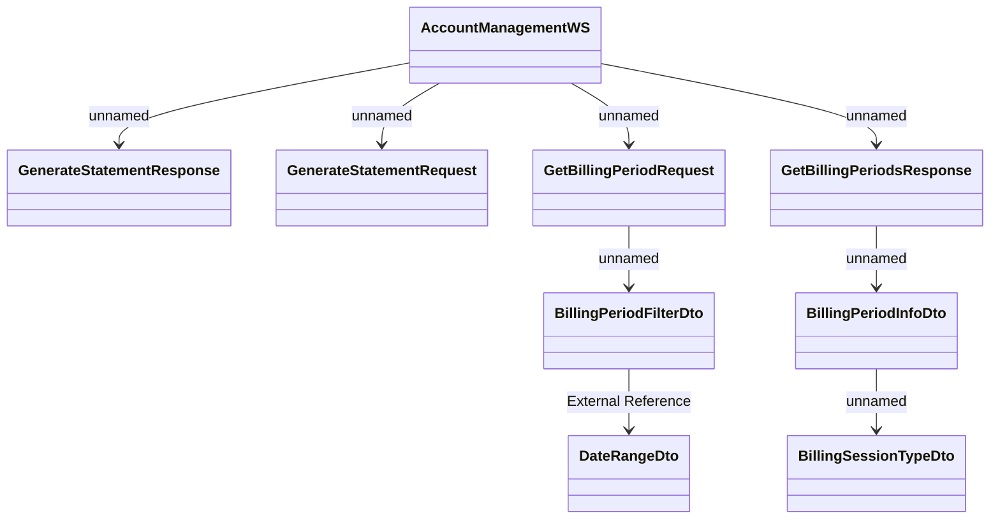

# AccountManagementWS - Print last statement

```mermaid
classDiagram
    class BillingPeriodFilterDto["BillingPeriodFilterDto"]
    class DateRangeDto["DateRangeDto"]
    class GenerateStatementResponse["GenerateStatementResponse"]
    class GenerateStatementRequest["GenerateStatementRequest"]
    class BillingPeriodInfoDto["BillingPeriodInfoDto"]
    class BillingSessionTypeDto["BillingSessionTypeDto"]
    class GetBillingPeriodsResponse["GetBillingPeriodsResponse"]
    class GetBillingPeriodRequest["GetBillingPeriodRequest"]
    class AccountManagementWS["AccountManagementWS"]
    AccountManagementWS --> GetBillingPeriodRequest : unnamed
    AccountManagementWS --> GetBillingPeriodsResponse : unnamed
    GetBillingPeriodsResponse --> BillingPeriodInfoDto : unnamed
    AccountManagementWS --> GenerateStatementRequest : unnamed
    AccountManagementWS --> GenerateStatementResponse : unnamed
    BillingPeriodFilterDto --> DateRangeDto : External Reference
    GetBillingPeriodRequest --> BillingPeriodFilterDto : unnamed
    BillingPeriodInfoDto --> BillingSessionTypeDto : unnamed
```
