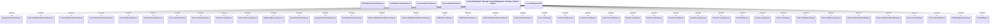

# AccountManagementWS - Service overview

```mermaid
classDiagram
    class GetDailyBalanceHistoryResponse["GetDailyBalanceHistoryResponse"]
    class GetDailyBalanceHistoryRequest["GetDailyBalanceHistoryRequest"]
    class GetAccruedInterestResponse["GetAccruedInterestResponse"]
    class GetAccruedInterestRequest["GetAccruedInterestRequest"]
    class GetPossibleBlockingReasonsResponse["GetPossibleBlockingReasonsResponse"]
    class GetPossibleBlockingReasonsRequest["GetPossibleBlockingReasonsRequest"]
    class GetBillingPeriodsResponse["GetBillingPeriodsResponse"]
    class GetBillingPeriodRequest["GetBillingPeriodRequest"]
    class GetAccountBillingPeriodBalancesResponse["GetAccountBillingPeriodBalancesResponse"]
    class GetAccountBillingPeriodBalancesRequest["GetAccountBillingPeriodBalancesRequest"]
    class TerminateSimulationResponse["TerminateSimulationResponse"]
    class RepaymentSimulationResponse["RepaymentSimulationResponse"]
    class TerminateSimulationRequest["TerminateSimulationRequest"]
    class RepaymentSimulationRequest["RepaymentSimulationRequest"]
    class GetAccountHistoryResponse["GetAccountHistoryResponse"]
    class GetAccountHistoryRequest["GetAccountHistoryRequest"]
    class Account_Management_Messages_Account_Management_Messages_Inte["Account Management - Messages : Account Management - Messages - Interface diagram"]
    class GetAccountItemsResponse["GetAccountItemsResponse"]
    class GetAccountItemsRequest["GetAccountItemsRequest"]
    class GenerateStatementResponse["GenerateStatementResponse"]
    class GenerateStatementRequest["GenerateStatementRequest"]
    class ContractUpdateNotificationResponse["ContractUpdateNotificationResponse"]
    class ContractUpdateNotificationRequest["ContractUpdateNotificationRequest"]
    class UnblockAccountResponse["UnblockAccountResponse"]
    class UnblockAccountRequest["UnblockAccountRequest"]
    class GetBlockingReasonsResponse["GetBlockingReasonsResponse"]
    class GetBlockingReasonsRequest["GetBlockingReasonsRequest"]
    class GetAccountListResponse["GetAccountListResponse"]
    class GetAccountListRequest["GetAccountListRequest"]
    class GetAccountBalanceByCuidResponse["GetAccountBalanceByCuidResponse"]
    class GetAccountBalanceByCuidRequest["GetAccountBalanceByCuidRequest"]
    class GetAccountBalanceResponse["GetAccountBalanceResponse"]
    class GetAccountBalanceRequest["GetAccountBalanceRequest"]
    class GetAccountResponse["GetAccountResponse"]
    class GetAccountRequest["GetAccountRequest"]
    class DoPayoffResponse["DoPayoffResponse"]
    class DoPayoffRequest["DoPayoffRequest"]
    class CancelAccountResponse["CancelAccountResponse"]
    class CancelAccountRequest["CancelAccountRequest"]
    class BlockAccountResponse["BlockAccountResponse"]
    class BlockAccountRequest["BlockAccountRequest"]
    class ActivateAccountResponse["ActivateAccountResponse"]
    class ActivateAccountRequest["ActivateAccountRequest"]
    class CreateAccountResponse["CreateAccountResponse"]
    class CreateAccountRequest["CreateAccountRequest"]
    class AccountManagementWS["AccountManagementWS"]
    AccountManagementWS --> RepaymentSimulationRequest : unnamed
    AccountManagementWS --> GetPossibleBlockingReasonsResponse : unnamed
    AccountManagementWS --> ContractUpdateNotificationRequest : unnamed
    AccountManagementWS --> ContractUpdateNotificationResponse : unnamed
    AccountManagementWS --> GenerateStatementRequest : unnamed
    AccountManagementWS --> GenerateStatementResponse : unnamed
    AccountManagementWS --> GetAccountItemsRequest : unnamed
    AccountManagementWS --> GetAccountItemsResponse : unnamed
    AccountManagementWS --> UnblockAccountRequest : unnamed
    AccountManagementWS --> GetAccountHistoryResponse : unnamed
    AccountManagementWS --> GetBlockingReasonsResponse : unnamed
    AccountManagementWS --> TerminateSimulationRequest : unnamed
    AccountManagementWS --> RepaymentSimulationResponse : unnamed
    AccountManagementWS --> TerminateSimulationResponse : unnamed
    AccountManagementWS --> GetAccountBillingPeriodBalancesRequest : unnamed
    AccountManagementWS --> GetAccountBillingPeriodBalancesResponse : unnamed
    AccountManagementWS --> GetBillingPeriodRequest : unnamed
    AccountManagementWS --> GetBillingPeriodsResponse : unnamed
    AccountManagementWS --> GetPossibleBlockingReasonsRequest : unnamed
    AccountManagementWS --> GetAccountHistoryRequest : unnamed
    AccountManagementWS --> GetAccountRequest : unnamed
    AccountManagementWS --> CreateAccountResponse : unnamed
    AccountManagementWS --> ActivateAccountRequest : unnamed
    AccountManagementWS --> ActivateAccountResponse : unnamed
    AccountManagementWS --> BlockAccountRequest : unnamed
    AccountManagementWS --> BlockAccountResponse : unnamed
    AccountManagementWS --> CancelAccountRequest : unnamed
    AccountManagementWS --> CancelAccountResponse : unnamed
    AccountManagementWS --> UnblockAccountResponse : unnamed
    AccountManagementWS --> DoPayoffResponse : unnamed
    AccountManagementWS --> CreateAccountRequest : unnamed
    AccountManagementWS --> GetAccountResponse : unnamed
    AccountManagementWS --> GetAccountBalanceRequest : unnamed
    AccountManagementWS --> GetAccountBalanceResponse : unnamed
    AccountManagementWS --> GetAccountBalanceByCuidRequest : unnamed
    AccountManagementWS --> GetAccountBalanceByCuidResponse : unnamed
    AccountManagementWS --> GetAccountListRequest : unnamed
    AccountManagementWS --> GetAccountListResponse : unnamed
    AccountManagementWS --> GetBlockingReasonsRequest : unnamed
    AccountManagementWS --> DoPayoffRequest : unnamed
```
