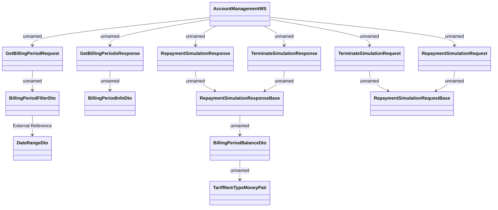

# AccountManagementWS - Terminate account

```mermaid
classDiagram
    class RepaymentSimulationRequest["RepaymentSimulationRequest"]
    class RepaymentSimulationResponse["RepaymentSimulationResponse"]
    class TariffItemTypeMoneyPair["TariffItemTypeMoneyPair"]
    class BillingPeriodFilterDto["BillingPeriodFilterDto"]
    class DateRangeDto["DateRangeDto"]
    class BillingPeriodInfoDto["BillingPeriodInfoDto"]
    class BillingPeriodBalanceDto["BillingPeriodBalanceDto"]
    class GetBillingPeriodRequest["GetBillingPeriodRequest"]
    class GetBillingPeriodsResponse["GetBillingPeriodsResponse"]
    class RepaymentSimulationResponseBase["RepaymentSimulationResponseBase"]
    class TerminateSimulationResponse["TerminateSimulationResponse"]
    class TerminateSimulationRequest["TerminateSimulationRequest"]
    class RepaymentSimulationRequestBase["RepaymentSimulationRequestBase"]
    class AccountManagementWS["AccountManagementWS"]
    TerminateSimulationRequest --> RepaymentSimulationRequestBase : unnamed
    RepaymentSimulationRequest --> RepaymentSimulationRequestBase : unnamed
    AccountManagementWS --> TerminateSimulationRequest : unnamed
    AccountManagementWS --> TerminateSimulationResponse : unnamed
    RepaymentSimulationResponse --> RepaymentSimulationResponseBase : unnamed
    TerminateSimulationResponse --> RepaymentSimulationResponseBase : unnamed
    AccountManagementWS --> GetBillingPeriodsResponse : unnamed
    AccountManagementWS --> GetBillingPeriodRequest : unnamed
    GetBillingPeriodsResponse --> BillingPeriodInfoDto : unnamed
    BillingPeriodFilterDto --> DateRangeDto : External Reference
    GetBillingPeriodRequest --> BillingPeriodFilterDto : unnamed
    BillingPeriodBalanceDto --> TariffItemTypeMoneyPair : unnamed
    AccountManagementWS --> RepaymentSimulationResponse : unnamed
    AccountManagementWS --> RepaymentSimulationRequest : unnamed
    RepaymentSimulationResponseBase --> BillingPeriodBalanceDto : unnamed
```
